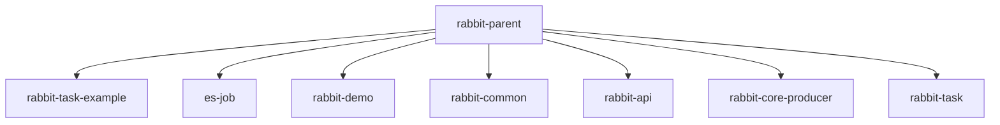

# 基础信息

|      |      |
|------|------|
| 名称 | rabbit-parent |
| 编码语言 | .java |
| 代码路径 | rabbit-parent |
| 包名 | rabbit-parent.docs |
| 概述说明 | Spring Boot与ElasticJob的分布式任务调度示例，含定时任务、分片处理及监听器。 |

# 说明

## 概述  
该代码模块是一个综合性的分布式系统解决方案集合，主要包含以下核心功能组件：  
1. **分布式任务调度**：基于ElasticJob和Zookeeper实现定时任务的分片执行与协调。  
2. **消息队列处理**：通过RabbitMQ提供可靠的消息通信、序列化及持久化能力。  
3. **Spring Boot集成**：标准化应用启动与自动配置，支持快速扩展和部署。  

模块采用分层架构设计，涵盖任务调度、消息生产/消费、异常处理、数据持久化等完整链路，适用于高并发、分布式场景下的任务与消息管理需求。  

## 什么是rabbit-parent?  
`rabbit-parent`是一个多模块的Java项目，整合了ElasticJob分布式任务调度和RabbitMQ消息队列两大核心技术栈，主要包含以下子模块：  

1. **任务调度模块**  
   - 实现基于ElasticJob的分布式任务调度（如`rabbit-task-example`、`es-job`），支持：  
     - 简单定时任务（`SimpleJob`）与数据流任务（`DataflowJob`）  
     - 分片处理、故障转移、事件监听（如`SimpleJobListener`）  
     - Zookeeper协调与作业状态持久化  

2. **消息队列模块**  
   - 提供完整的RabbitMQ消息处理能力（如`rabbit-api`、`rabbit-core-producer`），特性包括：  
     - 多类型消息投递（迅速/确认/可靠消息）  
     - 消息序列化（JSON/Jackson）、延迟投递、失败重试  
     - 生产者端的消息落库与状态管理（`BrokerMessage`）  

3. **公共组件模块**  
   - 封装通用工具（如`rabbit-common`），涵盖：  
     - 消息转换器（`RabbitMessageConverter`）  
     - 异常体系（`MessageException`）  
     - MyBatis类型处理器（`MessageJsonTypeHandler`）  

**典型应用场景**  
- 电商订单状态同步（分布式任务+可靠消息投递）  
- 日志收集与ETL处理（数据流任务+高吞吐消息队列）  
- 定时对账报表生成（分片任务+事务消息保障）  

**技术栈**  
- 核心框架：Spring Boot, ElasticJob, RabbitMQ  
- 中间件：Zookeeper  
- 数据层：MyBatis, 关系型数据库  
- 工具库：Lombok, Jackson, Slf4j

### 包内部结构视图

该流程图展示了rabbit-parent项目下的模块结构关系。作为父级项目，rabbit-parent直接包含7个子模块：rabbit-task-example示例模块、es-job数据处理模块、rabbit-demo演示模块、rabbit-common公共组件模块、rabbit-api接口模块、rabbit-core-producer核心生产者模块以及rabbit-task任务模块。所有子模块均以rabbit-parent为统一父节点，形成清晰的层级结构。

# 文件列表 File List

| 名称   | 类型  | 说明 |
|-------|------|-------------|
| [rabbit-demo](rabbit-demo/src/main/java/com/_module.md) | module | SpringBoot应用启动类，包含主方法运行应用。 |
| [rabbit-task](rabbit-task/src/main/java/com/_module.md) | module | Spring模块自动配置Elastic-Job与Zookeeper连接，管理注册中心和注解解析。 |
| [rabbit-core-producer](rabbit-core-producer/src/main/java/com/_module.md) | module | RabbitMQ生产者模块，含消息存储、状态管理、异步发送、重试机制及数据库配置，确保可靠投递。 |
| [rabbit-api](rabbit-api/src/main/java/com/_module.md) | module | 基于RabbitMQ的消息通信API，支持多种消息类型和发送模式，提供异常处理类。 |
| [rabbit-common](rabbit-common/src/main/java/com/_module.md) | module | FastJson工具类实现JSON与Java对象互转。RabbitMQ消息转换模块处理延迟消息和通用序列化。Jackson序列化工具支持JSON处理。MyBatis类型处理器实现Message与JSON互转。 |
| [es-job](es-job/src/main/java/com/_module.md) | module | Java定时任务模块，含SimpleJob、DataflowJob和类型检查工具，支持日志记录和泛型处理。 |
| [rabbit-task-example](rabbit-task-example/src/main/java/com/_module.md) | module | TestSimpleJob作业类配置ElasticJob，5秒执行，2分片，带监听器。SimpleJobListener记录任务前后日志。ExampleApplication是SpringBoot入口。 |

