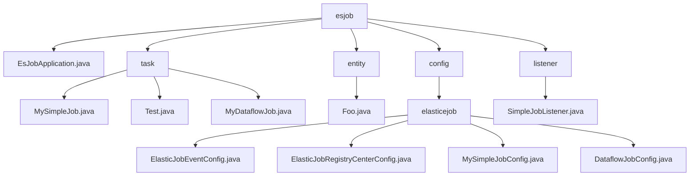

# 基础信息

|      |      |
|------|------|
| 名称 | com |
| 编码语言 | .java |
| 代码路径 | rabbit-parent/es-job/src/main/java/com |
| 包名 | rabbit-parent.docs.es-job.src.main.java.com |
| 概述说明 | Java定时任务模块，含SimpleJob、DataflowJob和类型检查工具，支持日志记录和泛型处理。 |

# 说明

## 概述  
该代码模块是一个基于Spring Boot和ElasticJob的分布式定时任务调度系统，主要提供以下核心功能：  

1. **任务调度执行**  
   - 支持`SimpleJob`（简单定时任务）和`DataflowJob`（数据流式任务）两种作业类型。  
   - 通过`MySimpleJob`实现基础任务触发与日志记录，适用于无状态任务场景（如定时清理、心跳检测）。  
   - 通过`MyDataflowJob`实现分片数据抓取（`fetchData`）与处理（`processData`），支持泛型（`Foo`）增强灵活性，适用于订单同步、报表生成等场景。  

2. **分布式协调与配置**  
   - 集成Zookeeper作为注册中心，支持作业节点注册与发现。  
   - 提供动态分片配置、超时控制、重试机制等调度策略。  
   - 支持作业事件（启动/完成/失败）持久化到关系型数据库，便于监控与查询。  

3. **辅助工具与扩展**  
   - 通过`Test`类验证类型系统，确保任务类符合`ElasticJob`规范。  
   - 使用`SimpleJobListener`监听任务执行前后事件，记录上下文信息（JSON格式）。  
   - 基于Spring Boot的`EsJobApplication`作为应用入口，简化部署。  

模块技术栈：  
- 核心框架：ElasticJob + Spring Boot  
- 工具库：Lombok（简化代码）、Slf4j（日志记录）  
- 数据存储：Zookeeper（协调）、关系型数据库（事件追踪）  

## 主要业务场景  

1. **简单定时任务调度**  
   - 场景：定时触发无状态任务，如日志清理、系统状态检查。  
   - 实现：通过`MySimpleJob`直接执行任务逻辑，配合`SimpleJobListener`记录执行日志。  

2. **分布式数据流处理**  
   - 场景：分批次处理大规模数据（如订单同步、ETL作业）。  
   - 实现流程：  
     - `fetchData`：按分片从数据源抓取数据（如数据库分页查询）。  
     - `processData`：对数据集合进行业务处理（转换、存储或消息发送）。  
   - 关键特性：泛型支持（`Foo`键值对结构）、分片自动分配、流式处理模式配置。  

3. **作业监控与故障排查**  
   - 场景：追踪任务执行状态、分析失败原因。  
   - 实现：  
     - 通过`SimpleJobListener`记录任务上下文（ShardingContexts）。  
     - 将作业事件持久化到数据库，提供历史记录查询。  

4. **动态调度配置**  
   - 场景：运行时调整分片策略或容错机制。  
   - 实现：通过ElasticJob配置类动态修改参数（如分片总数、cron表达式）。  

**技术亮点**  
- 泛型与分片机制结合，提升数据流任务的通用性和扩展性。  
- 事件监听与持久化实现全链路监控。  
- 基于Zookeeper的分布式协调保障高可用性。

### 包内部结构视图

该流程图展示了es-job模块的Java代码结构，以esjob为根节点，包含任务处理(task)、实体类(entity)、配置(config)和监听器(listener)四个主要分支。配置分支下进一步细分为elasticjob相关配置，包含四种不同类型的配置类。任务分支包含三个具体任务实现类，实体分支包含一个Foo类，监听器分支包含一个简单任务监听器。

# 文件列表 File List

| 名称   | 类型  | 说明 |
|-------|------|-------------|
| [itihub](itihub/_module.md) | package | Java定时任务模块，含SimpleJob、DataflowJob和类型检查工具，支持日志记录和泛型处理。 |

