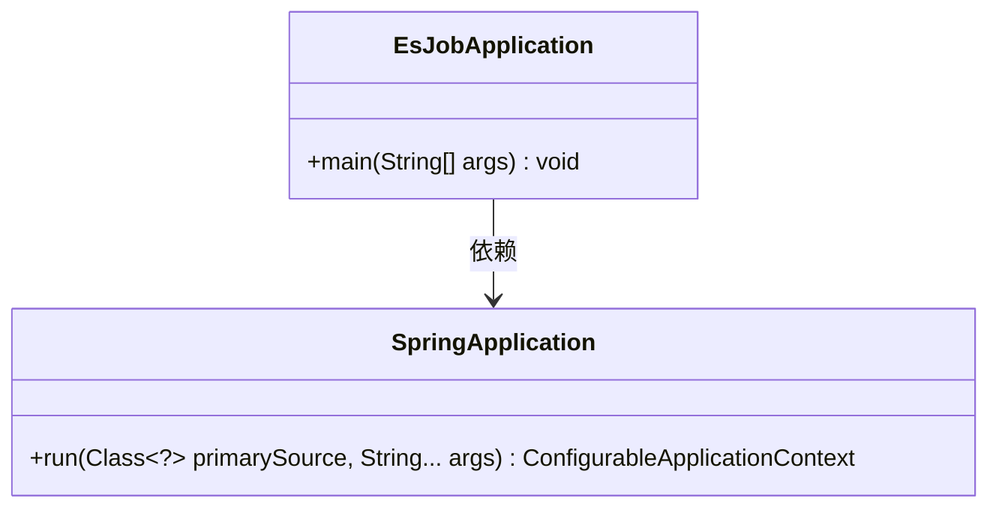
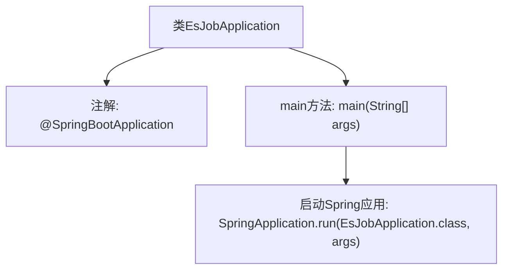

# 基础信息

|      |      |
|------|------|
| 名称 | EsJobApplication |
| 编码语言 | .java |
| 代码路径 | rabbit-parent/es-job/src/main/java/com/itihub/esjob/EsJobApplication.java |
| 包名 | com.itihub.esjob |
| 依赖项 | ['org.springframework.boot.SpringApplication', 'org.springframework.boot.autoconfigure.SpringBootApplication'] |
| 概述说明 | SpringBoot应用启动类，运行主方法启动。 |

# 说明

这是一个使用Spring Boot框架的Java应用程序主类。类名为EsJobApplication，标注了@SpringBootApplication注解，表明这是一个Spring Boot应用的入口点。类中包含一个标准的main方法，通过调用SpringApplication.run来启动整个Spring Boot应用。这个类遵循了Spring Boot应用的标准结构，没有额外自定义的配置或逻辑。

# 类列表 Class Summary

| 名称   | 类型  | 说明 |
|-------|------|-------------|
| EsJobApplication | class | SpringBoot应用启动类，主方法运行Spring应用。 |

## 类 EsJobApplication

|      |      |
|------|------|
| 访问范围 | @SpringBootApplication;public |
| 类型 | class |
| 名称 | EsJobApplication |
| 说明 | SpringBoot应用启动类，主方法运行Spring应用。 |

### UML类图

这段类图展示了Spring Boot应用的启动结构。EsJobApplication类作为主启动类，通过main方法调用SpringApplication的run方法来启动应用。SpringApplication类是Spring Boot的核心启动类，提供运行Spring应用的静态方法。图中清晰地表现了启动类对SpringApplication的依赖关系，符合Spring Boot应用的典型启动流程。

### 内部方法调用关系图

这段流程图展示了EsJobApplication类的核心结构。该类被@SpringBootApplication注解标记，表明这是一个Spring Boot应用的主配置类。程序入口是main方法，该方法通过调用SpringApplication.run()来启动整个Spring应用，传入当前类对象和命令行参数作为参数。这个简洁的流程清晰地反映了Spring Boot应用的启动机制，从注解配置到容器初始化的关键步骤。

### 字段列表 Field List

| 名称  | 类型  | 说明 |
|-------|-------|------|

### 方法列表 Method List

| 名称  | 类型  | 说明 |
|-------|-------|------|
| main | void | Java主方法启动Spring应用。 |

