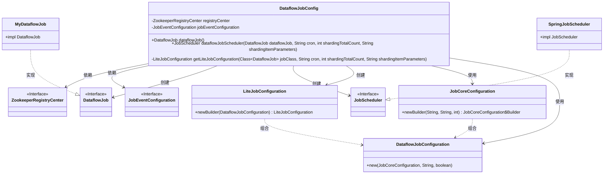
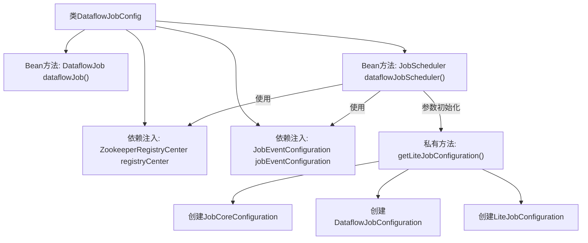

# 基础信息

|      |      |
|------|------|
| 名称 | DataflowJobConfig |
| 编码语言 | .java |
| 代码路径 | rabbit-parent/es-job/src/main/java/com/itihub/esjob/config/elasticejob/DataflowJobConfig.java |
| 包名 | com.itihub.esjob.config.elasticejob |
| 依赖项 | ['com.dangdang.ddframe.job.api.dataflow.DataflowJob', 'com.dangdang.ddframe.job.config.JobCoreConfiguration', 'com.dangdang.ddframe.job.config.dataflow.DataflowJobConfiguration', 'com.dangdang.ddframe.job.event.JobEventConfiguration', 'com.dangdang.ddframe.job.lite.api.JobScheduler', 'com.dangdang.ddframe.job.lite.config.LiteJobConfiguration', 'com.dangdang.ddframe.job.lite.spring.api.SpringJobScheduler', 'com.dangdang.ddframe.job.reg.zookeeper.ZookeeperRegistryCenter', 'com.itihub.esjob.task.MyDataflowJob', 'org.springframework.beans.factory.annotation.Autowired', 'org.springframework.beans.factory.annotation.Value', 'org.springframework.context.annotation.Bean', 'org.springframework.context.annotation.Configuration'] |
| 概述说明 | 配置类定义数据流作业，包含调度器、注册中心和事件配置。 |

# 说明

该配置类定义了一个基于Spring框架的数据流作业调度系统。它通过注解自动装配Zookeeper注册中心和作业事件配置。核心功能包括：定义一个自定义数据流作业Bean，以及初始化一个作业调度器Bean。调度器通过外部配置参数（如cron表达式、分片总数和分片参数）构建轻量级作业配置，支持流式处理模式。整个配置利用Spring的依赖注入机制，将作业实现与调度框架解耦，实现了可扩展的分布式任务调度解决方案。

# 类列表 Class Summary

| 名称   | 类型  | 说明 |
|-------|------|-------------|
| DataflowJobConfig | class | 配置类定义数据流作业，包含调度器和作业配置。 |

## 类 DataflowJobConfig

|      |      |
|------|------|
| 访问范围 | @Configuration;public |
| 类型 | class |
| 名称 | DataflowJobConfig |
| 说明 | 配置类定义数据流作业，包含调度器和作业配置。 |

### UML类图

这段代码是一个Spring配置类，用于配置Elastic-Job的数据流作业。DataflowJobConfig类通过依赖注入获取Zookeeper注册中心和作业事件配置，创建DataflowJob实例和JobScheduler调度器。核心逻辑是通过getLiteJobConfiguration方法构建作业配置，包括作业核心配置(JobCoreConfiguration)、数据流作业配置(DataflowJobConfiguration)和轻量级作业配置(LiteJobConfiguration)。整个配置过程体现了Spring与Elastic-Job框架的集成，通过参数化配置实现作业的动态调度。

### 内部方法调用关系图

这段代码是Spring配置类，用于创建Elastic-Job的数据流作业调度器。核心流程包含三个关键步骤：1) 创建自定义DataflowJob实例；2) 通过getLiteJobConfiguration方法构建作业配置（包括核心配置、数据流配置和轻量级配置）；3) 初始化JobScheduler时整合注册中心、事件配置和作业配置。整个过程实现了分布式定时任务的自动化装配，特别支持流式处理模式的分片参数配置。

### 字段列表 Field List

| 名称  | 类型  | 说明 |
|-------|-------|------|
| registryCenter | ZookeeperRegistryCenter | 自动注入Zookeeper注册中心实例。 |
| jobEventConfiguration | JobEventConfiguration | 自动注入JobEventConfiguration实例。 |

### 方法列表 Method List

| 名称  | 类型  | 说明 |
|-------|-------|------|
| getLiteJobConfiguration | LiteJobConfiguration | 创建轻量级作业配置，含核心参数和流式处理设置。 |
| dataflowJob | DataflowJob | 定义一个Bean方法，返回MyDataflowJob实例。 |
| dataflowJobScheduler | JobScheduler | 创建Spring定时任务调度器，配置cron表达式、分片总数及参数。 |

