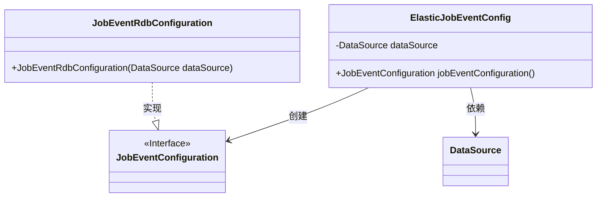
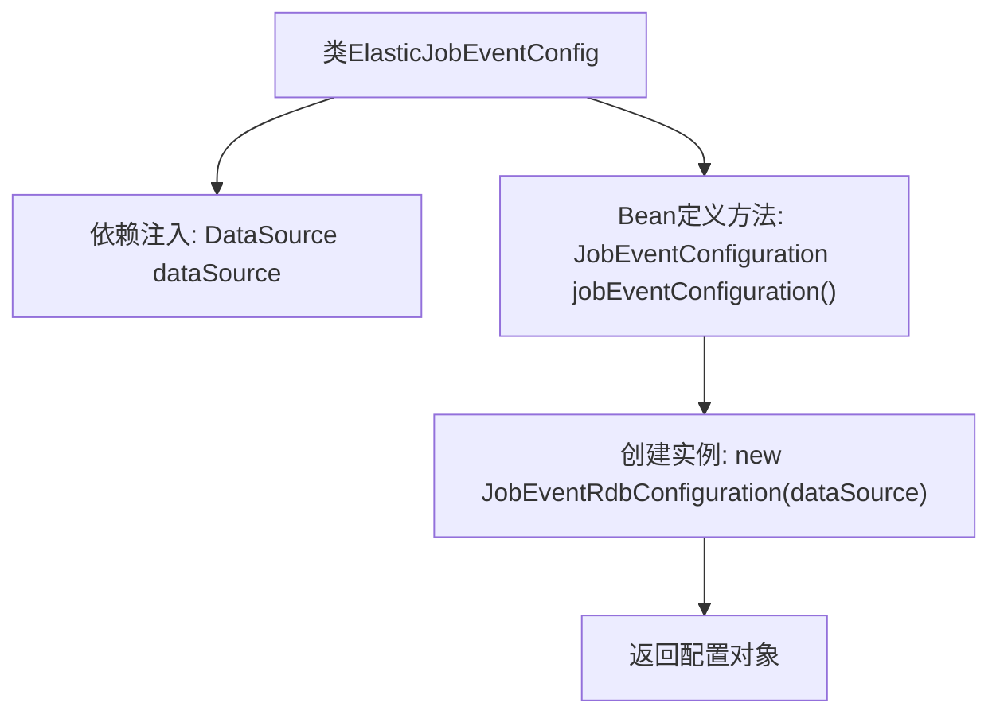

# 基础信息

|      |      |
|------|------|
| 名称 | ElasticJobEventConfig |
| 编码语言 | .java |
| 代码路径 | rabbit-parent/es-job/src/main/java/com/itihub/esjob/config/elasticejob/ElasticJobEventConfig.java |
| 包名 | com.itihub.esjob.config.elasticejob |
| 依赖项 | ['com.dangdang.ddframe.job.event.JobEventConfiguration', 'com.dangdang.ddframe.job.event.rdb.JobEventRdbConfiguration', 'org.springframework.beans.factory.annotation.Autowired', 'org.springframework.context.annotation.Bean', 'org.springframework.context.annotation.Configuration', 'javax.sql.DataSource'] |
| 概述说明 | 配置ElasticJob事件存储，使用数据源初始化RDB事件配置。 |

# 说明

该内容描述了一个Spring配置类ElasticJobEventConfig，用于配置ElasticJob的事件记录功能。该类通过@Autowired注解注入了一个DataSource实例，并定义了一个名为jobEventConfiguration的Bean。该Bean通过JobEventRdbConfiguration类实现，将作业事件记录到关系型数据库中，传入的参数是之前注入的dataSource。整个配置简洁明了，实现了作业事件与数据库的集成。

# 类列表 Class Summary

| 名称   | 类型  | 说明 |
|-------|------|-------------|
| ElasticJobEventConfig | class | 配置ElasticJob事件存储，使用数据源初始化RDB事件配置。 |

## 类 ElasticJobEventConfig

|      |      |
|------|------|
| 访问范围 | @Configuration;public |
| 类型 | class |
| 名称 | ElasticJobEventConfig |
| 说明 | 配置ElasticJob事件存储，使用数据源初始化RDB事件配置。 |

### UML类图

这段类图展示了Spring配置类ElasticJobEventConfig的结构及其依赖关系。该类通过@Autowired注入DataSource，并定义了一个@Bean方法创建JobEventConfiguration实例。JobEventRdbConfiguration实现了JobEventConfiguration接口，并在构造时依赖DataSource。整体结构体现了Spring的依赖注入和配置模式，其中接口与实现类的关系清晰可见。

### 内部方法调用关系图

该流程图展示了Spring配置类ElasticJobEventConfig的核心结构。首先通过@Autowired注入DataSource依赖，然后通过@Bean注解定义一个JobEventConfiguration类型的Bean。在Bean创建过程中，使用注入的dataSource初始化JobEventRdbConfiguration实例，最终返回该配置对象。整个过程体现了Spring依赖注入和Bean生命周期的典型用法，用于构建ElasticJob的事件追踪存储配置。

### 字段列表 Field List

| 名称  | 类型  | 说明 |
|-------|-------|------|
| dataSource | DataSource | 自动注入数据源对象。 |

### 方法列表 Method List

| 名称  | 类型  | 说明 |
|-------|-------|------|
| jobEventConfiguration | JobEventConfiguration | 定义JobEventConfiguration Bean，使用JobEventRdbConfiguration并注入dataSource。 |

