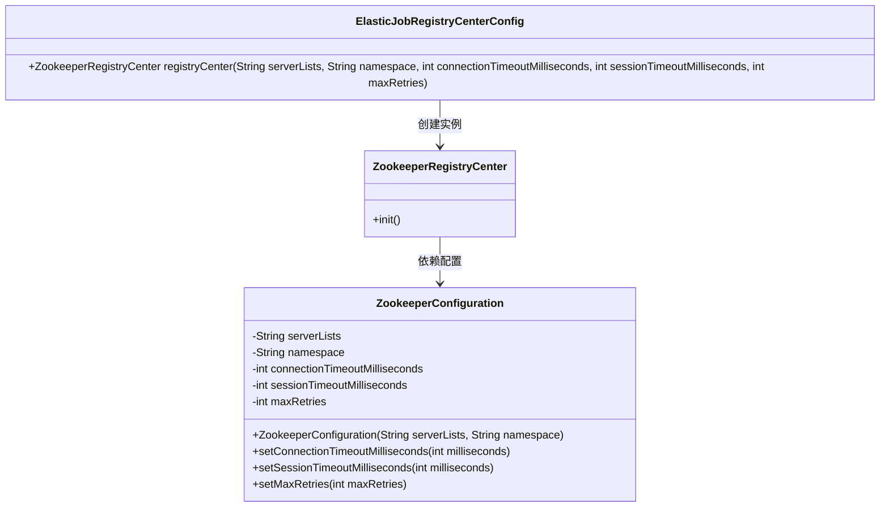
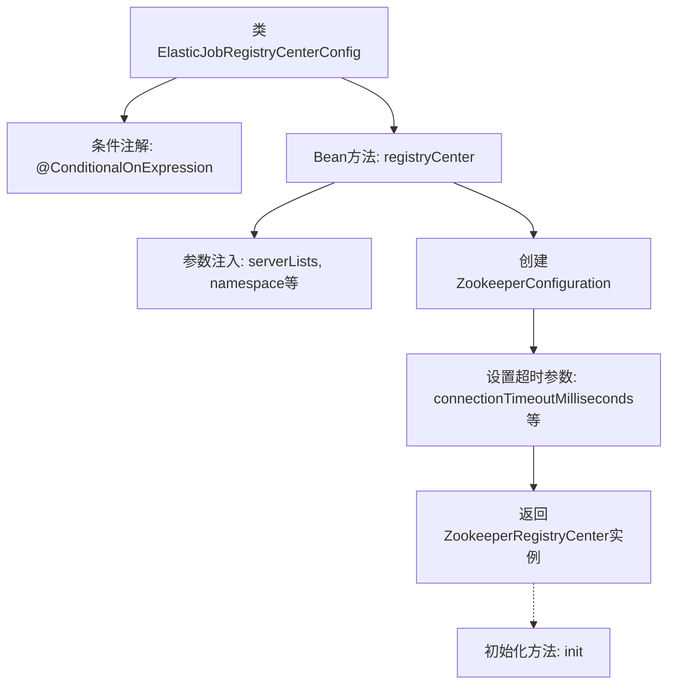

# 基础信息

|      |      |
|------|------|
| 名称 | ElasticJobRegistryCenterConfig |
| 编码语言 | .java |
| 代码路径 | rabbit-parent/es-job/src/main/java/com/itihub/esjob/config/elasticejob/ElasticJobRegistryCenterConfig.java |
| 包名 | com.itihub.esjob.config.elasticejob |
| 依赖项 | ['com.dangdang.ddframe.job.reg.zookeeper.ZookeeperConfiguration', 'com.dangdang.ddframe.job.reg.zookeeper.ZookeeperRegistryCenter', 'org.springframework.beans.factory.annotation.Value', 'org.springframework.boot.autoconfigure.condition.ConditionalOnExpression', 'org.springframework.context.annotation.Bean', 'org.springframework.context.annotation.Configuration'] |
| 概述说明 | 配置Zookeeper注册中心，初始化参数并注入Spring容器。 |

# 说明

该配置类用于在满足条件时将Zookeeper注册到Spring容器中。当配置项elastic-job.zookeeper.serverLists不为空时，会创建一个ZookeeperRegistryCenter实例。该实例通过ZookeeperConfiguration配置，包含服务器地址、命名空间、连接超时时间、会话超时时间和最大重试次数等参数。初始化方法为init。

# 类列表 Class Summary

| 名称   | 类型  | 说明 |
|-------|------|-------------|
| ElasticJobRegistryCenterConfig | class | 配置Zookeeper注册中心，初始化参数并注入Spring容器。 |

## 类 ElasticJobRegistryCenterConfig

|      |      |
|------|------|
| 访问范围 | @Configuration;@ConditionalOnExpression("'${elastic-job.zookeeper.serverLists}'.length() > 0");public |
| 类型 | class |
| 名称 | ElasticJobRegistryCenterConfig |
| 说明 | 配置Zookeeper注册中心，初始化参数并注入Spring容器。 |

### UML类图

这段代码描述了一个Spring配置类ElasticJobRegistryCenterConfig，用于初始化Zookeeper注册中心。当配置项elastic-job.zookeeper.serverLists非空时，该类会创建一个ZookeeperRegistryCenter实例，并通过ZookeeperConfiguration配置连接参数（如服务器列表、命名空间、超时时间和重试次数）。类图中展示了三个主要类及其关系：配置类负责创建注册中心实例，注册中心依赖配置类进行初始化。

### 内部方法调用关系图

这段代码是一个Spring配置类，用于在满足条件时（Zookeeper服务器列表非空）向容器注册Zookeeper注册中心。流程图展示了从类定义到Bean创建的完整过程：首先检查条件注解，然后通过registryCenter方法接收配置参数，创建并配置ZookeeperConfiguration对象，最终生成ZookeeperRegistryCenter实例并通过init方法初始化。整个过程体现了Spring容器管理Bean生命周期的典型模式。

### 字段列表 Field List

| 名称  | 类型  | 说明 |
|-------|-------|------|

### 方法列表 Method List

| 名称  | 类型  | 说明 |
|-------|-------|------|
| registryCenter | ZookeeperRegistryCenter | 创建Zookeeper注册中心，配置连接参数并初始化。 |

