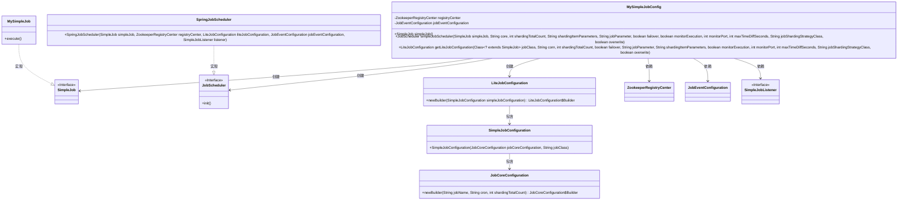
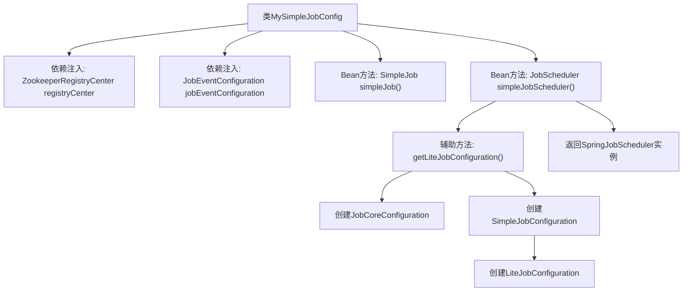

# 基础信息

|      |      |
|------|------|
| 名称 | MySimpleJobConfig |
| 编码语言 | .java |
| 代码路径 | rabbit-parent/es-job/src/main/java/com/itihub/esjob/config/elasticejob/MySimpleJobConfig.java |
| 包名 | com.itihub.esjob.config.elasticejob |
| 依赖项 | ['com.dangdang.ddframe.job.api.simple.SimpleJob', 'com.dangdang.ddframe.job.config.JobCoreConfiguration', 'com.dangdang.ddframe.job.config.simple.SimpleJobConfiguration', 'com.dangdang.ddframe.job.event.JobEventConfiguration', 'com.dangdang.ddframe.job.lite.api.JobScheduler', 'com.dangdang.ddframe.job.lite.config.LiteJobConfiguration', 'com.dangdang.ddframe.job.lite.spring.api.SpringJobScheduler', 'com.dangdang.ddframe.job.reg.zookeeper.ZookeeperRegistryCenter', 'com.itihub.esjob.listener.SimpleJobListener', 'com.itihub.esjob.task.MySimpleJob', 'org.springframework.beans.factory.annotation.Autowired', 'org.springframework.beans.factory.annotation.Value', 'org.springframework.context.annotation.Bean', 'org.springframework.context.annotation.Configuration'] |
| 概述说明 | Spring配置类，定义ElasticJob定时任务，包含任务逻辑和调度器配置。 |

# 说明

该配置类定义了ElasticJob与Spring集成的定时任务框架。通过@Bean注解注册了两个核心组件：simpleJob定义了具体任务逻辑，simpleJobScheduler负责调度配置。后者通过读取多个外部参数（如cron表达式、分片数、容错开关等）构建LiteJobConfiguration，包含任务核心配置、监控参数和分片策略，最终结合Zookeeper注册中心与事件监听器创建SpringJobScheduler实例。getLiteJobConfiguration方法封装了作业配置的详细构建过程，支持分片参数、超时控制等分布式调度特性。

# 类列表 Class Summary

| 名称   | 类型  | 说明 |
|-------|------|-------------|
| MySimpleJobConfig | class | Spring配置类，定义ElasticJob定时任务，包含任务调度器和配置构建方法。 |

## 类 MySimpleJobConfig

|      |      |
|------|------|
| 访问范围 | @Configuration;public |
| 类型 | class |
| 名称 | MySimpleJobConfig |
| 说明 | Spring配置类，定义ElasticJob定时任务，包含任务调度器和配置构建方法。 |

### UML类图

这段代码是一个Spring配置类，主要用于配置ElasticJob的定时任务。MySimpleJobConfig类通过@Bean方法创建SimpleJob实例和JobScheduler调度器，其中JobScheduler使用LiteJobConfiguration进行任务配置。类图中展示了配置类与ElasticJob核心组件（如JobCoreConfiguration、SimpleJobConfiguration等）的关系，以及通过SpringJobScheduler实现的任务调度机制。整个结构体现了Spring与ElasticJob的集成方式，包含任务配置、注册中心、事件监听等关键元素。

### 内部方法调用关系图

这段代码是一个Spring配置类，用于配置ElasticJob定时任务。流程图展示了从配置类初始化到最终创建JobScheduler的完整过程：首先注入Zookeeper注册中心和事件配置，然后定义SimpleJob实例，接着通过simpleJobScheduler方法构建完整的作业配置（包括核心配置、简单作业配置和轻量级作业配置），最后返回一个集成了所有配置的SpringJobScheduler实例。整个过程体现了ElasticJob与Spring框架的深度集成方式。

### 字段列表 Field List

| 名称  | 类型  | 说明 |
|-------|-------|------|
| jobEventConfiguration | JobEventConfiguration | 自动注入JobEventConfiguration实例 |
| registryCenter | ZookeeperRegistryCenter | 自动注入Zookeeper注册中心实例。 |

### 方法列表 Method List

| 名称  | 类型  | 说明 |
|-------|-------|------|
| simpleJob | SimpleJob | 定义一个Spring Bean，返回MySimpleJob实例。 |
| simpleJobScheduler | JobScheduler | 创建JobScheduler实例，配置定时任务参数并初始化。 |
| getLiteJobConfiguration | LiteJobConfiguration | 创建LiteJob配置，含核心参数、分片策略及监控选项。 |

