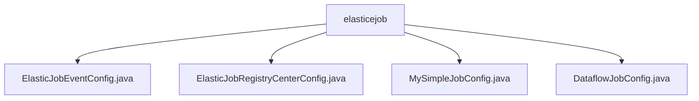

# 基础信息

|      |      |
|------|------|
| 名称 | elasticejob |
| 编码语言 | .java |
| 代码路径 | rabbit-parent/es-job/src/main/java/com/itihub/esjob/config/elasticejob |
| 包名 | rabbit-parent.docs.es-job.src.main.java.com.itihub.esjob.config.elasticejob |
| 概述说明 | Spring配置类实现ElasticJob事件记录、Zookeeper注册及分布式任务调度功能。 |

# 说明

# ElasticJob 配置模块总结

## 概述
该模块是基于Spring框架和ElasticJob实现的分布式任务调度系统，主要提供以下核心功能：
1. 与Zookeeper集成的注册中心配置
2. 多种作业类型支持（SimpleJob/DataflowJob）
3. 作业事件持久化到关系型数据库
4. 可配置的分布式调度策略

模块通过四个配置类实现完整调度功能，支持参数化配置、分片处理、作业监控等企业级特性。

## 主要业务场景
1. **分布式定时任务调度**：
   - 通过SimpleJob实现常规定时任务
   - 通过DataflowJob实现流式数据处理任务
   - 支持cron表达式配置调度策略

2. **作业事件追踪**：
   - 将作业执行事件（启动/完成/失败等）持久化到关系型数据库
   - 提供作业执行历史记录查询能力

3. **分布式协调**：
   - 基于Zookeeper实现作业节点注册与发现
   - 支持分片任务在集群中的自动分配
   - 配置超时控制（连接超时/会话超时）和重试机制

4. **弹性调度配置**：
   - 支持动态配置分片总数和分片参数
   - 可开启/关闭作业容错机制
   - 支持流式处理模式配置

### 包内部结构视图

该流程图展示了elasticjob配置模块的层级结构，根节点为elasticejob文件夹，包含4个Java配置类文件：ElasticJobEventConfig、ElasticJobRegistryCenterConfig、MySimpleJobConfig和DataflowJobConfig。这些配置类共同构成了ElasticJob框架的核心配置功能，用于定义不同类型作业的注册中心、事件监听以及简单作业和数据流作业的具体配置实现。

# 文件列表 File List

| 名称   | 类型  | 说明 |
|-------|------|-------------|
| [DataflowJobConfig.java](DataflowJobConfig.md) | file | 配置类定义数据流作业，包含调度器、注册中心和事件配置。 |
| [MySimpleJobConfig.java](MySimpleJobConfig.md) | file | Spring配置类，定义ElasticJob定时任务，包含任务逻辑和调度器配置。 |
| [ElasticJobRegistryCenterConfig.java](ElasticJobRegistryCenterConfig.md) | file | 配置Zookeeper注册中心，初始化参数并注入Spring容器。 |
| [ElasticJobEventConfig.java](ElasticJobEventConfig.md) | file | 配置ElasticJob事件存储，使用数据源初始化RDB事件配置。 |

