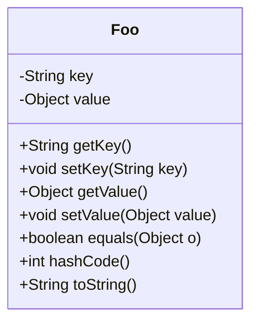
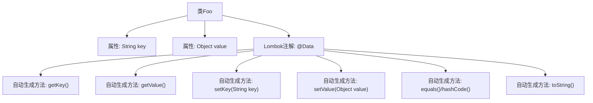

# 基础信息

|      |      |
|------|------|
| 名称 | Foo |
| 编码语言 | .java |
| 代码路径 | rabbit-parent/es-job/src/main/java/com/itihub/esjob/entity/Foo.java |
| 包名 | com.itihub.esjob.entity |
| 依赖项 | ['lombok.Data'] |
| 概述说明 | 类Foo含私有字段key和value。 |

# 说明

这是一个名为Foo的Java类，使用@Data注解自动生成getter、setter等方法。类中包含两个私有成员变量：key为String类型，value为Object类型。该结构常用于存储键值对数据。

# 类列表 Class Summary

| 名称   | 类型  | 说明 |
|-------|------|-------------|
| Foo | class | 类Foo包含私有字段key和value。 |

## 类 Foo

|      |      |
|------|------|
| 访问范围 | @Data;public |
| 类型 | class |
| 名称 | Foo |
| 说明 | 类Foo包含私有字段key和value。 |

### UML类图

这段类图展示了一个简单的数据类Foo，使用Lombok的@Data注解自动生成getter/setter、equals()、hashCode()和toString()方法。类包含两个私有字段：String类型的key和Object类型的value，后者可以存储任意类型的数据。通过自动生成的方法，该类提供了标准的数据访问和对象比较功能，适用于需要快速创建POJO(Plain Old Java Object)的场景。

### 内部方法调用关系图

该流程图展示了使用Lombok @Data注解的Foo类结构。@Data注解会自动生成所有字段的getter/setter方法、equals()、hashCode()和toString()方法，避免了手动编写样板代码。图中清晰呈现了类与属性、注解与衍生方法之间的层级关系，其中注解作为核心节点触发6种不同方法的自动生成。这种设计模式显著减少了代码量，同时保持了完整的JavaBean功能。

### 字段列表 Field List

| 名称  | 类型  | 说明 |
|-------|-------|------|
| value | Object | 私有对象值变量 |
| key | String | 私有字符串变量key |

### 方法列表 Method List

| 名称  | 类型  | 说明 |
|-------|-------|------|

