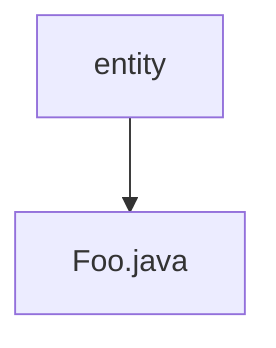

# 基础信息

|      |      |
|------|------|
| 名称 | entity |
| 编码语言 | .java |
| 代码路径 | rabbit-parent/es-job/src/main/java/com/itihub/esjob/entity |
| 包名 | rabbit-parent.docs.es-job.src.main.java.com.itihub.esjob.entity |
| 概述说明 | 类Foo含私有字段key和value。 |

# 说明

这是一个名为Foo的Java类，使用@Data注解自动生成getter、setter等方法。类中包含两个私有成员变量：key为String类型，value为Object类型。该结构常用于存储键值对数据。

### 包内部结构视图

该流程图展示了`rabbit-parent/es-job`项目中的实体类结构，根节点为`entity`目录，其下包含一个具体的实体类文件`Foo.java`。这种单层结构表明当前路径信息仅包含一个实体目录及其直接子文件，属于简单的项目文件层级关系。

# 文件列表 File List

| 名称   | 类型  | 说明 |
|-------|------|-------------|
| [Foo.java](Foo.md) | file | 类Foo含私有字段key和value。 |

