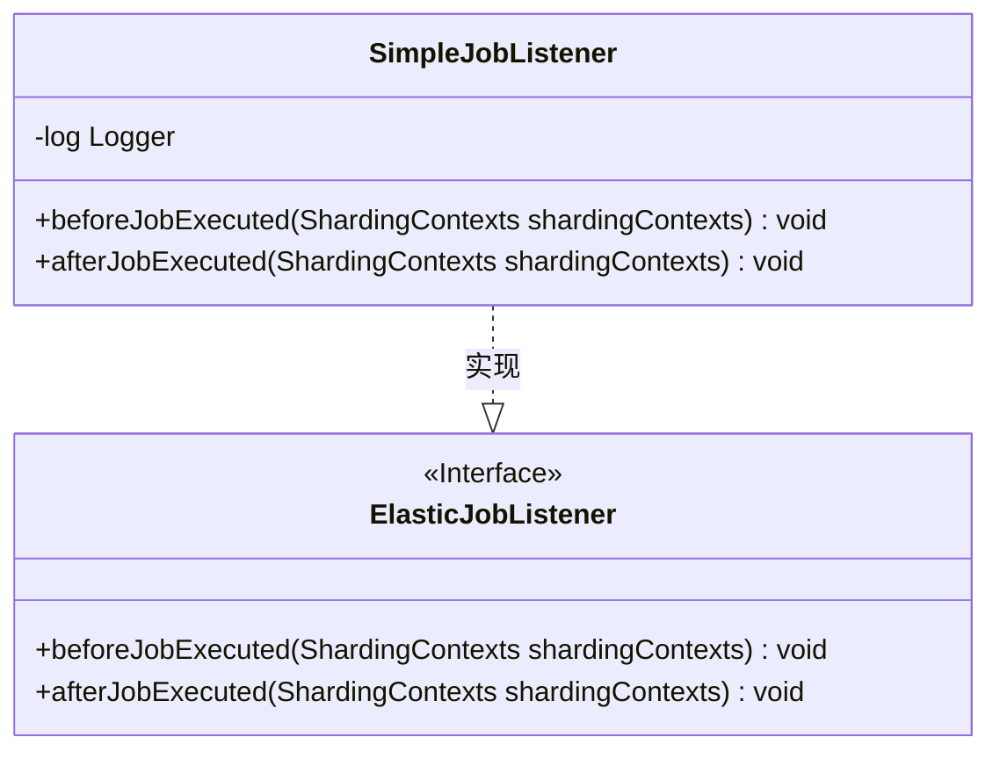
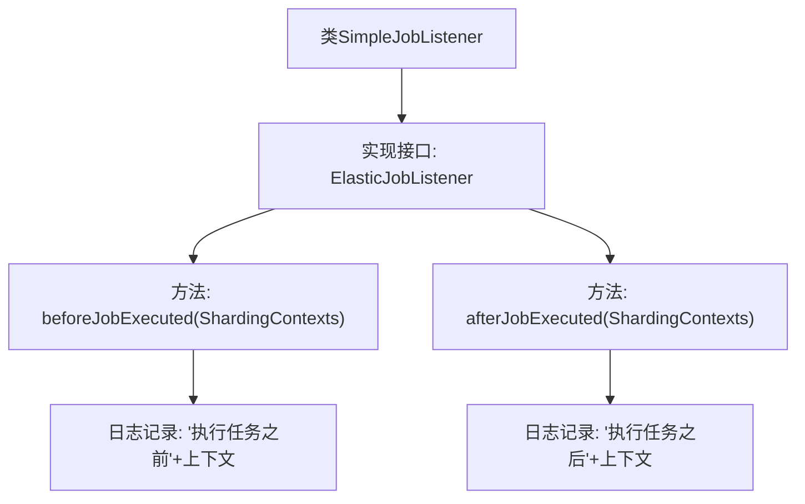

# 基础信息

|      |      |
|------|------|
| 名称 | SimpleJobListener |
| 编码语言 | .java |
| 代码路径 | rabbit-parent/es-job/src/main/java/com/itihub/esjob/listener/SimpleJobListener.java |
| 包名 | com.itihub.esjob.listener |
| 依赖项 | ['com.alibaba.fastjson.JSON', 'com.dangdang.ddframe.job.executor.ShardingContexts', 'com.dangdang.ddframe.job.lite.api.listener.ElasticJobListener', 'lombok.extern.slf4j.Slf4j'] |
| 概述说明 | SimpleJobListener类实现ElasticJobListener接口，记录任务执行前后分片上下文日志。 |

# 说明

该内容描述了一个名为SimpleJobListener的Java类，实现了ElasticJobListener接口。该类包含两个方法：beforeJobExecuted在任务执行前被调用，afterJobExecuted在任务执行后被调用。两个方法均接收ShardingContexts参数，并通过日志记录上下文信息，使用JSON格式输出。类使用了Lombok的@Slf4j注解自动生成日志对象。

# 类列表 Class Summary

| 名称   | 类型  | 说明 |
|-------|------|-------------|
| SimpleJobListener | class | SimpleJobListener实现ElasticJobListener接口，记录任务执行前后分片上下文日志。 |

## 类 SimpleJobListener

|      |      |
|------|------|
| 访问范围 | @Slf4j;public |
| 类型 | class |
| 名称 | SimpleJobListener |
| 说明 | SimpleJobListener实现ElasticJobListener接口，记录任务执行前后分片上下文日志。 |

### UML类图

该代码展示了一个实现ElasticJobListener接口的SimpleJobListener类，用于在分布式任务执行前后记录日志。类图清晰地体现了接口与实现类的关系，其中SimpleJobListener通过实现beforeJobExecuted和afterJobExecuted方法，分别在任务分片执行前后输出上下文信息到日志。日志记录使用Lombok的@Slf4j注解自动生成logger实例，并通过JSON序列化工具格式化输出分片上下文对象。

### 内部方法调用关系图

该流程图展示了SimpleJobListener类的结构，该类实现了ElasticJobListener接口。主要包含两个核心方法：beforeJobExecuted在任务执行前触发，记录分片上下文信息；afterJobExecuted在任务执行后触发，同样记录上下文。两个方法均通过log.info输出带JSON格式上下文的日志，形成任务执行的生命周期监控点。箭头方向明确表示了类与接口的继承关系以及方法调用流程。

### 字段列表 Field List

| 名称  | 类型  | 说明 |
|-------|-------|------|

### 方法列表 Method List

| 名称  | 类型  | 说明 |
|-------|-------|------|
| beforeJobExecuted | void | 重写方法，任务执行前打印分片上下文日志。 |
| afterJobExecuted | void | 重写方法，任务执行后记录分片上下文日志。 |

