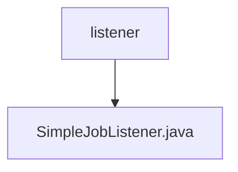

# 基础信息

|      |      |
|------|------|
| 名称 | listener |
| 编码语言 | .java |
| 代码路径 | rabbit-parent/es-job/src/main/java/com/itihub/esjob/listener |
| 包名 | rabbit-parent.docs.es-job.src.main.java.com.itihub.esjob.listener |
| 概述说明 | SimpleJobListener类实现ElasticJobListener接口，记录任务执行前后分片上下文日志。 |

# 说明

该内容描述了一个名为SimpleJobListener的Java类，实现了ElasticJobListener接口。该类包含两个方法：beforeJobExecuted在任务执行前被调用，afterJobExecuted在任务执行后被调用。两个方法均接收ShardingContexts参数，并通过日志记录上下文信息，使用JSON格式输出。类使用了Lombok的@Slf4j注解自动生成日志对象。

### 包内部结构视图

该流程图展示了Java项目中的监听器模块结构。顶层节点为listener目录，其下包含一个具体的监听器实现文件SimpleJobListener.java。这种结构常见于事件监听或任务调度系统，通过单一监听器处理特定任务，体现了简洁的模块化设计思想。

# 文件列表 File List

| 名称   | 类型  | 说明 |
|-------|------|-------------|
| [SimpleJobListener.java](SimpleJobListener.md) | file | SimpleJobListener类实现ElasticJobListener接口，记录任务执行前后分片上下文日志。 |

