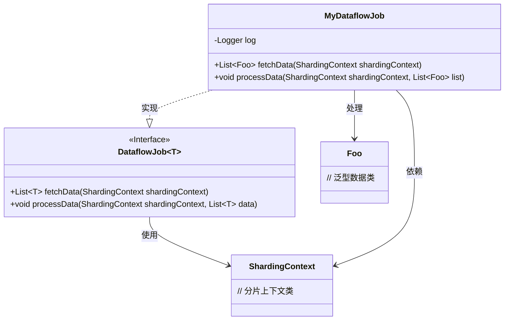
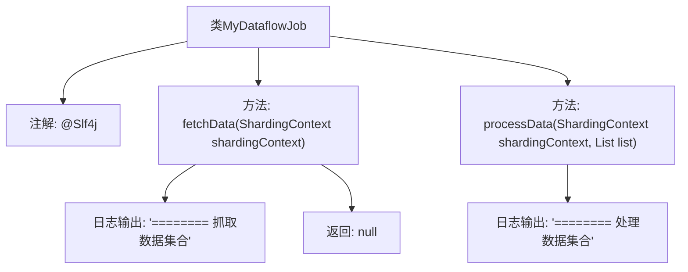

# 基础信息

|      |      |
|------|------|
| 名称 | MyDataflowJob |
| 编码语言 | .java |
| 代码路径 | rabbit-parent/es-job/src/main/java/com/itihub/esjob/task/MyDataflowJob.java |
| 包名 | com.itihub.esjob.task |
| 依赖项 | ['com.dangdang.ddframe.job.api.ShardingContext', 'com.dangdang.ddframe.job.api.dataflow.DataflowJob', 'com.itihub.esjob.entity.Foo', 'lombok.extern.slf4j.Slf4j', 'java.util.List'] |
| 概述说明 | 数据流作业类，实现数据抓取和处理方法。 |

# 说明

这是一个名为MyDataflowJob的Java类，实现了DataflowJob接口，泛型类型为Foo。该类包含两个核心方法：fetchData用于抓取数据集合，接收ShardingContext参数并返回Foo类型列表，方法内打印日志标记数据抓取；processData用于处理数据集合，接收ShardingContext和Foo列表参数，方法内打印日志标记数据处理。类使用了Lombok的@Slf4j注解自动生成日志对象。

# 类列表 Class Summary

| 名称   | 类型  | 说明 |
|-------|------|-------------|
| MyDataflowJob | class | 数据流作业类，实现数据抓取与处理接口。 |

## 类 MyDataflowJob

|      |      |
|------|------|
| 访问范围 | @Slf4j;public |
| 类型 | class |
| 名称 | MyDataflowJob |
| 说明 | 数据流作业类，实现数据抓取与处理接口。 |

### UML类图

这段代码展示了一个实现DataflowJob接口的MyDataflowJob类，用于数据流处理任务。类图清晰地呈现了MyDataflowJob与泛型接口DataflowJob的继承关系，其中Foo作为泛型参数类型。ShardingContext作为分片上下文被接口和实现类共同使用，而实现类通过Lombok的@Slf4j注解自动生成日志对象。该结构体现了典型的数据抓取-处理模式，接口定义了数据获取和处理两个核心方法，实现类负责具体业务逻辑实现。

### 内部方法调用关系图

该流程图展示了MyDataflowJob类的结构，包含两个核心方法：fetchData用于抓取数据并记录日志后返回null，processData用于处理数据并记录日志。类使用@Slf4j注解提供日志功能，方法间通过ShardingContext参数传递分片上下文信息，体现了ElasticJob数据处理任务的基本流程。

### 字段列表 Field List

| 名称  | 类型  | 说明 |
|-------|-------|------|

### 方法列表 Method List

| 名称  | 类型  | 说明 |
|-------|-------|------|
| processData | void | 处理数据集合方法，记录日志。 |
| fetchData | List<Foo> | 覆盖fetchData方法，记录日志并返回空列表。 |

