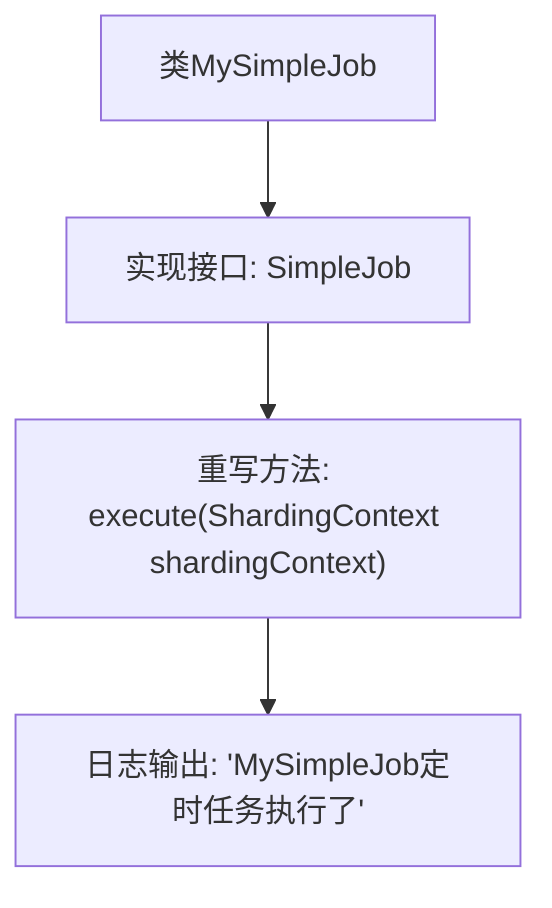

# 基础信息

|      |      |
|------|------|
| 名称 | MySimpleJob |
| 编码语言 | .java |
| 代码路径 | rabbit-parent/es-job/src/main/java/com/itihub/esjob/task/MySimpleJob.java |
| 包名 | com.itihub.esjob.task |
| 依赖项 | ['com.dangdang.ddframe.job.api.ShardingContext', 'com.dangdang.ddframe.job.api.simple.SimpleJob', 'lombok.extern.slf4j.Slf4j'] |
| 概述说明 | MySimpleJob实现SimpleJob接口，执行时打印日志。 |

# 说明

这是一个使用Slf4j日志框架的Java类，名为MySimpleJob，实现了SimpleJob接口。类中包含一个execute方法，接收ShardingContext参数，方法内通过日志记录定时任务执行信息。该类的核心功能是作为定时任务执行器，当任务触发时会打印执行日志。整个实现简洁明了，专注于任务执行时的日志记录功能。

# 类列表 Class Summary

| 名称   | 类型  | 说明 |
|-------|------|-------------|
| MySimpleJob | class | Java定时任务类MySimpleJob，执行时打印日志。 |


## 类 MySimpleJob

|      |      |
|------|------|
| 访问范围 | @Slf4j;public |
| 类型 | class |
| 名称 | MySimpleJob |
| 说明 | Java定时任务类MySimpleJob，执行时打印日志。 |


### UML类图

```mermaid
classDiagram
    <<Interface>> SimpleJob {
        <<Interface>>
        +execute(ShardingContext shardingContext) void
    }

    class MySimpleJob {
        -Logger log
        +execute(ShardingContext shardingContext) void
    }

    SimpleJob <|-- MySimpleJob : 实现
```

这段代码展示了一个定时任务实现类MySimpleJob与其接口SimpleJob的关系。SimpleJob接口定义了execute方法，MySimpleJob实现了该接口并添加了日志记录功能。类图清晰地呈现了接口与实现类之间的继承关系，以及MySimpleJob特有的日志成员变量。该结构体现了面向接口编程的原则，便于扩展不同的定时任务实现。


### 内部方法调用关系图



这段代码展示了一个实现SimpleJob接口的定时任务类MySimpleJob。流程图清晰地描述了类与接口的继承关系，以及方法调用的执行路径。当定时任务被触发时，会调用execute方法，该方法通过@Slf4j注解的log对象记录执行日志。整个流程简洁明了，体现了定时任务的基本执行逻辑和日志记录功能。

### 字段列表 Field List

| 名称  | 类型  | 说明 |
|-------|-------|------|

### 方法列表 Method List

| 名称  | 类型  | 说明 |
|-------|-------|------|
| execute | void | 定时任务MySimpleJob执行日志记录 |


