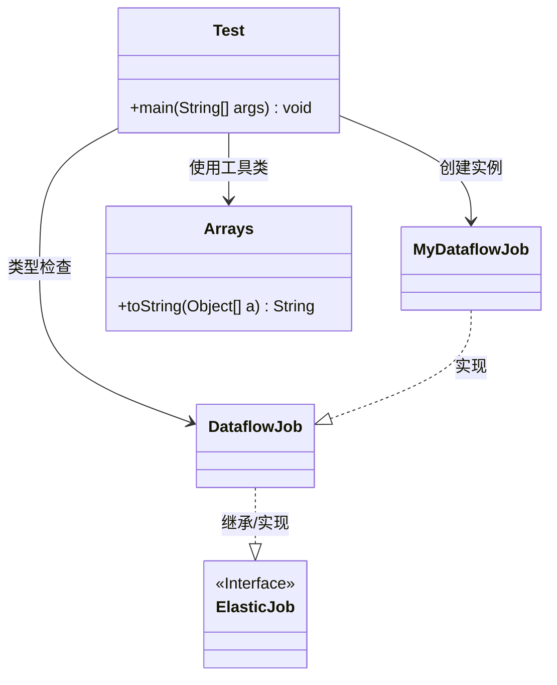
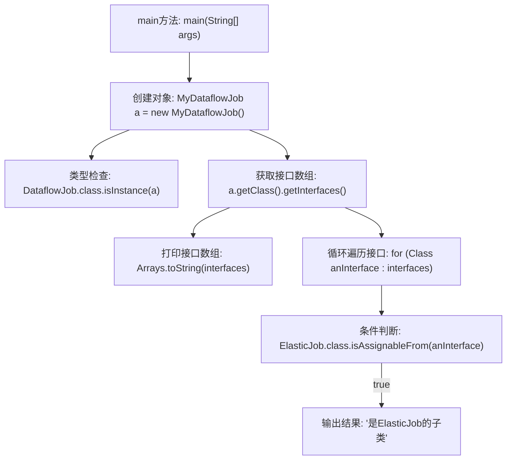

# 基础信息

|      |      |
|------|------|
| 名称 | Test |
| 编码语言 | .java |
| 代码路径 | rabbit-parent/es-job/src/main/java/com/itihub/esjob/task/Test.java |
| 包名 | com.itihub.esjob.task |
| 依赖项 | ['com.dangdang.ddframe.job.api.ElasticJob', 'com.dangdang.ddframe.job.api.dataflow.DataflowJob', 'java.util.Arrays'] |
| 概述说明 | Java代码示例：检查类实例与接口继承关系。 |

# 说明

这段Java代码演示了类型检查和接口继承关系的验证。程序创建了一个MyDataflowJob实例a，首先检查a是否是DataflowJob类的实例并输出结果。接着获取a实现的所有接口数组，打印这些接口信息。然后遍历每个接口，使用三种不同方式（注释状态）判断当前接口是否继承自ElasticJob接口，若符合条件则输出"是ElasticJob的子类"。主要展示了instanceof、isAssignableFrom等方法在类型系统检查中的应用。

# 类列表 Class Summary

| 名称   | 类型  | 说明 |
|-------|------|-------------|
| Test | class | Java代码测试类实例类型检查与接口判断。 |

## 类 Test

|      |      |
|------|------|
| 访问范围 | public |
| 类型 | class |
| 名称 | Test |
| 说明 | Java代码测试类实例类型检查与接口判断。 |

### UML类图

这段代码展示了Java类型系统的运行时检查机制，主要涉及MyDataflowJob与DataflowJob、ElasticJob之间的继承/实现关系验证。Test类通过反射API检查对象类型信息，使用getInterfaces()获取实现接口，并通过isAssignableFrom()判断接口继承关系。代码演示了三种常见的类型检查方式（isInstance/isAssignableFrom/instanceof）中的两种正确用法，其中被注释掉的instanceof用法不适用于Class对象比较。

### 内部方法调用关系图

这段代码的流程图展示了Java反射和类型检查的核心流程。程序首先创建MyDataflowJob实例，随后通过isInstance()验证其类型，获取并打印实现的所有接口，最后遍历接口检查是否为ElasticJob的子类。特别注意三种不同条件判断方式的差异（注释部分），流程图仅展示实际使用的isAssignableFrom()逻辑分支。该流程清晰体现了运行时类型检查的典型模式，适用于框架中动态类型验证的场景。

### 字段列表 Field List

| 名称  | 类型  | 说明 |
|-------|-------|------|

### 方法列表 Method List

| 名称  | 类型  | 说明 |
|-------|-------|------|
| main | void | Java代码检查类实例与接口关系，判断是否为ElasticJob子类。 |

