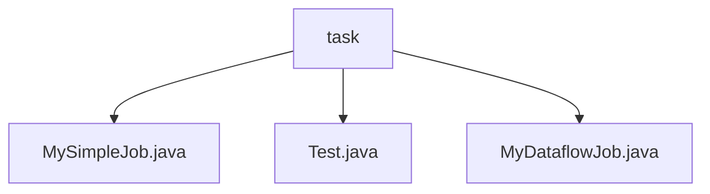

# 基础信息

|      |      |
|------|------|
| 名称 | task |
| 编码语言 | .java |
| 代码路径 | rabbit-parent/es-job/src/main/java/com/itihub/esjob/task |
| 包名 | rabbit-parent.docs.es-job.src.main.java.com.itihub.esjob.task |
| 概述说明 | MySimpleJob类实现SimpleJob接口，记录定时任务日志。Test类演示类型检查与接口继承验证。MyDataflowJob类实现DataflowJob接口，处理Foo类型数据。 |

# 说明

## 概述  
该代码模块是一个基于Java的定时任务处理模块，主要围绕`ElasticJob`框架实现不同类型的定时任务。模块包含以下核心组件：  

1. **MySimpleJob**：实现`SimpleJob`接口，作为基础定时任务执行器，专注于任务触发时的日志记录功能。  
2. **MyDataflowJob**：实现`DataflowJob`接口，支持数据流式任务处理，包含数据抓取（`fetchData`）和数据处理（`processData`）两个阶段，使用泛型（`Foo`）增强灵活性。  
3. **Test**：演示类型检查和接口继承关系的工具类，通过`instanceof`和`isAssignableFrom`等方法验证类型系统。  

模块整体采用Slf4j进行日志记录，部分类使用Lombok简化代码。  

## 主要业务场景  
1. **简单定时任务执行**  
   - 通过`MySimpleJob`实现无状态定时任务，适用于仅需触发执行并记录日志的场景（如定时清理、心跳检测等）。  

2. **数据流式任务处理**  
   - 通过`MyDataflowJob`实现分片数据抓取与处理，适用于需要分批次处理数据的场景（如订单同步、报表生成等）。  
   - 示例流程：  
     - `fetchData`：从数据源按分片获取数据集合（如数据库分页查询）。  
     - `processData`：对抓取的数据进行业务处理（如数据转换、存储或发送消息）。  

3. **类型系统验证**  
   - 在测试或框架扩展时，通过`Test`类演示的方法动态验证接口继承关系，确保自定义任务类符合`ElasticJob`的规范。  

**技术亮点**  
- 使用泛型（如`Foo`）提升数据流任务的通用性。  
- 结合Slf4j和Lombok实现简洁的日志管理。  
- 通过类型检查工具增强框架的健壮性和可扩展性。

### 包内部结构视图

该流程图展示了`task`目录下的三个Java文件之间的层级关系。`task`作为父节点，包含三个子节点：`MySimpleJob.java`、`Test.java`和`MyDataflowJob.java`。这些文件都属于同一个目录层级，没有进一步的嵌套结构。整个结构简洁明了，反映了任务模块中不同作业类的文件组织方式。

# 文件列表 File List

| 名称   | 类型  | 说明 |
|-------|------|-------------|
| [MySimpleJob.java](MySimpleJob.md) | file | MySimpleJob实现SimpleJob接口，执行时打印日志。 |
| [MyDataflowJob.java](MyDataflowJob.md) | file | 数据流作业类，实现数据抓取和处理方法。 |
| [Test.java](Test.md) | file | Java代码示例：检查类实例与接口继承关系。 |

