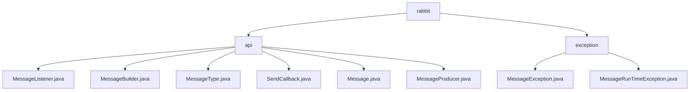

# 基础信息

|      |      |
|------|------|
| 名称 | rabbit |
| 编码语言 | .java |
| 代码路径 | rabbit-parent/rabbit-api/src/main/java/com/itihub/rabbit |
| 包名 | rabbit-parent.docs.rabbit-api.src.main.java.com.itihub.rabbit |
| 概述说明 | 基于RabbitMQ的消息通信API，支持多种消息类型和发送模式，提供异常处理类。 |

# 说明

## 概述  
该代码模块是一个基于RabbitMQ的消息通信API，主要分为两部分功能：  

1. **消息通信核心功能**  
   提供消息构建、发送、监听等核心能力，采用建造者模式灵活构建消息对象，支持多种消息类型（迅速消息、确认消息、可靠性消息）和发送模式（同步/异步、单条/批量）。通过回调接口处理发送结果，整体设计遵循单一职责原则。  

2. **异常处理机制**  
   包含自定义异常类`MessageException`（受检异常）和`MessageRunTimeException`（非受检异常），用于区分业务逻辑错误与系统级错误，支持多种异常构造方式，与Java异常体系无缝集成。  

## 主要业务场景  

### 消息通信功能  
1. **消息构建**  
   - 使用`MessageBuilder`链式配置消息ID、主题、路由规则等属性，支持自动生成消息ID和字段校验。  
   - 通过`MessageType`区分消息可靠性级别（如无需确认的RAPID类型、需原子性投递的RELIANT类型）。  

2. **消息发送**  
   - **异步发送**：结合`SendCallback`回调处理成功/失败逻辑。  
   - **同步发送**：支持单条或批量同步发送，异常时抛出`MessageRunTimeException`。  

3. **消息监听**  
   - 实现`MessageListener`接口的`onMessage`方法自定义处理逻辑。  

4. **典型应用**  
   - 订单支付通知（RELIANT类型确保可靠投递）。  
   - 高吞吐日志收集（允许丢失的RAPID类型）。  
   - 延迟任务调度（通过`delayMills`配置延迟时间）。  

### 异常处理功能  
1. **受检异常**（`MessageException`）  
   - 处理需显式捕获的业务异常（如消息处理失败、参数校验不合法）。  

2. **非受检异常**（`MessageRunTimeException`）  
   - 处理系统级错误（如队列连接中断、并发冲突），减少代码侵入性。  

**共性设计**：  
- 均支持无参构造、消息/原因组合构造，覆盖异常创建的常见场景。  
- 通过继承标准异常类（`Exception`/`RuntimeException`）保持兼容性。

### 包内部结构视图

该流程图展示了Rabbit消息队列项目的核心结构，分为api和exception两个主要模块。api模块包含6个关键消息处理类文件，包括消息构建、类型定义和生产者等核心功能；exception模块则包含两种异常处理类文件。所有节点均使用路径末端名称，清晰呈现了消息处理系统的分层架构。

# 文件列表 File List

| 名称   | 类型  | 说明 |
|-------|------|-------------|
| [exception](exception/_module.md) | package | 自定义异常类MessageException和MessageRunTimeException，分别继承Exception和RuntimeException，提供四种构造函数。 |
| [api](api/_module.md) | package | 消息监听接口、建造者模式消息类、消息类型枚举、发送回调接口、可序列化消息类、生产者接口。 |

