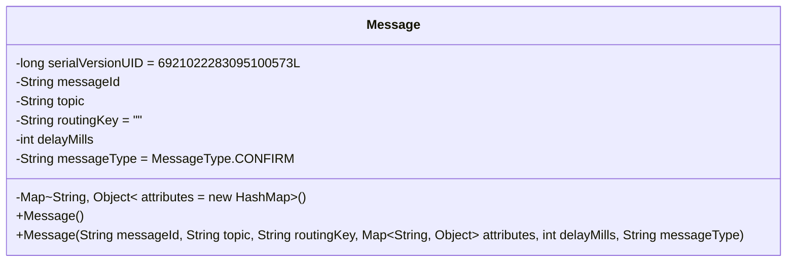
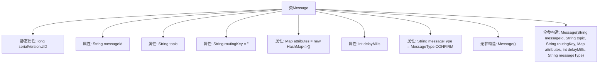

# 基础信息

|      |      |
|------|------|
| 名称 | Message |
| 编码语言 | .java |
| 代码路径 | rabbit-parent/rabbit-api/src/main/java/com/itihub/rabbit/api/Message.java |
| 包名 | com.itihub.rabbit.api |
| 依赖项 | ['lombok.Data', 'java.io.Serializable', 'java.util.HashMap', 'java.util.Map'] |
| 概述说明 | 消息类，含ID、主题、路由键、属性、延迟配置和类型。 |

# 说明

这是一个名为Message的Java类，实现了Serializable接口用于序列化。类中包含以下关键字段：messageId表示消息唯一标识，topic表示消息主题，routingKey表示路由规则默认为空字符串，attributes是消息附加属性的键值对集合，delayMills表示延迟毫秒数需RabbitMQ延迟插件支持，messageType表示消息类型默认为CONFIRM。提供了无参构造器和全参构造器，支持初始化所有字段。

# 类列表 Class Summary

| 名称   | 类型  | 说明 |
|-------|------|-------------|
| Message | class | 消息类含ID、主题、路由、属性、延迟和类型字段。 |

## 类 Message

|      |      |
|------|------|
| 访问范围 | @Data;public |
| 类型 | class |
| 名称 | Message |
| 说明 | 消息类含ID、主题、路由、属性、延迟和类型字段。 |

### UML类图

这段代码定义了一个可序列化的Message类，用于封装消息相关的数据。类中包含消息ID、主题、路由键、属性映射、延迟毫秒数和消息类型等字段，提供了无参构造器和全参构造器。该类通过实现Serializable接口支持序列化，适用于分布式系统中的消息传输场景，其中delayMills字段需要RabbitMQ延迟插件支持，messageType默认为CONFIRM类型。

### 内部方法调用关系图

这段代码定义了一个可序列化的Message类，用于封装消息相关的数据。类中包含7个核心属性：唯一ID、主题、路由键、属性映射表、延迟毫秒数和消息类型，其中routingKey和messageType带有默认值。提供无参构造器和全参构造器两种初始化方式，全参构造器可一次性设置所有属性。序列化版本号serialVersionUID用于保证版本兼容性，attributes属性使用HashMap存储扩展键值对，delayMills需配合RabbitMQ延迟插件使用。整体设计符合消息中间件中消息实体的常见规范。

### 字段列表 Field List

| 名称  | 类型  | 说明 |
|-------|-------|------|
| attributes = new HashMap<>() | Map<String, Object> | 私有属性映射，存储键值对。 |
| routingKey = "" | String | 私有字符串变量routingKey初始化为空。 |
| topic | String | 私有字符串变量topic |
| serialVersionUID = 6921022283095100573L | long | 私有静态长整型序列化版本UID。 |
| messageId | String | 私有字符串变量messageId |
| delayMills | int | 私有整型变量delayMills |
| messageType = MessageType.CONFIRM | String | 私有字符串messageType设为MessageType.CONFIRM。 |

### 方法列表 Method List

| 名称  | 类型  | 说明 |
|-------|-------|------|

