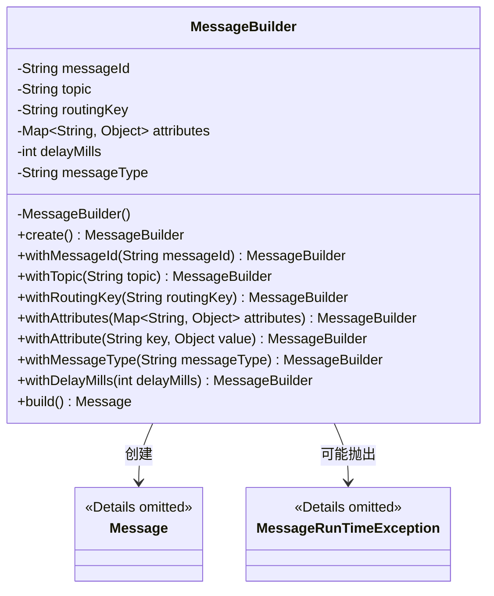
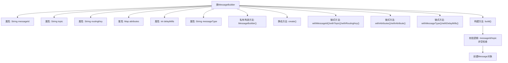

# 基础信息

|      |      |
|------|------|
| 名称 | MessageBuilder |
| 编码语言 | .java |
| 代码路径 | rabbit-parent/rabbit-api/src/main/java/com/itihub/rabbit/api/MessageBuilder.java |
| 包名 | com.itihub.rabbit.api |
| 依赖项 | ['com.itihub.rabbit.exception.MessageRunTimeException', 'java.util.HashMap', 'java.util.Map', 'java.util.UUID'] |
| 概述说明 | 消息构建类，含ID、主题、路由、属性、延迟和类型配置。 |

# 说明

该代码定义了一个MessageBuilder类，用于构建消息对象。类中包含消息ID、主题、路由规则、附加属性、延迟参数和消息类型等字段。通过私有构造方法和静态create方法初始化，提供链式调用的with方法设置各属性。build方法会校验消息ID和主题，自动生成ID或抛出异常，最终返回构建的Message对象。该类采用建造者模式，支持灵活配置消息属性。

# 类列表 Class Summary

| 名称   | 类型  | 说明 |
|-------|------|-------------|
| MessageBuilder | class | 消息构建类，含ID、主题、路由等属性，支持延迟和类型配置。 |

## 类 MessageBuilder

|      |      |
|------|------|
| 访问范围 | public |
| 类型 | class |
| 名称 | MessageBuilder |
| 说明 | 消息构建类，含ID、主题、路由等属性，支持延迟和类型配置。 |

### UML类图

这段代码展示了一个MessageBuilder类，采用建造者模式构建Message对象。类包含6个私有字段和9个方法，其中构造方法私有化，通过静态create()方法初始化。各withXxx()方法支持链式调用，build()方法执行校验逻辑（自动生成messageId、强制校验topic），最终构造Message实例。类图清晰地展现了MessageBuilder与Message的创建关系，以及与异常类MessageRunTimeException的潜在关联。

### 内部方法调用关系图

该流程图展示了MessageBuilder类的完整结构，包含7个私有属性、1个私有构造方法和6组公共方法。核心流程是通过链式调用配置消息参数，最终通过build()方法执行校验并创建Message对象。build()方法包含关键校验逻辑：自动生成messageId和强制topic非空检查，确保消息合法性。所有链式方法都返回this以实现流畅接口模式，属性配置顺序可自由组合。

### 字段列表 Field List

| 名称  | 类型  | 说明 |
|-------|-------|------|
| routingKey = "" | String | 私有字符串变量routingKey初始化为空。 |
| attributes = new HashMap<>() | Map<String, Object> | 私有属性映射表，键为字符串，值为对象。 |
| messageId | String | 私有字符串变量messageId |
| topic | String | 私有字符串变量topic |
| delayMills | int | 私有整型变量delayMills |
| messageType = MessageType.CONFIRM | String | 私有字符串messageType设为MessageType.CONFIRM |

### 方法列表 Method List

| 名称  | 类型  | 说明 |
|-------|-------|------|
| withTopic | MessageBuilder | 公开方法，设置主题并返回当前对象。 |
| withAttribute | MessageBuilder | 公开方法，设置属性并返回当前对象。 |
| create | MessageBuilder | 静态方法创建MessageBuilder实例。 |
| withMessageId | MessageBuilder | 公共方法设置消息ID并返回当前对象。 |
| withMessageType | MessageBuilder | 公开方法，设置消息类型并返回构建器实例。 |
| withAttributes | MessageBuilder | 公开方法，用Map设置属性并返回当前对象。 |
| withDelayMills | MessageBuilder | 公共方法设置延迟毫秒并返回自身。 |
| build | Message | 构建消息：检查ID和主题，无效则抛异常或生成ID，最终返回消息对象。 |
| withRoutingKey | MessageBuilder | 公共方法设置路由键并返回自身实例。 |

