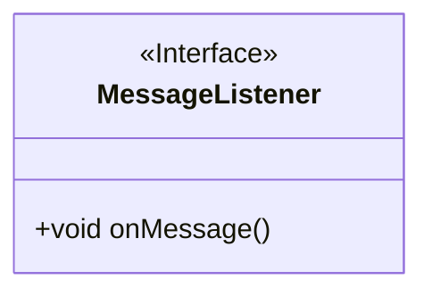
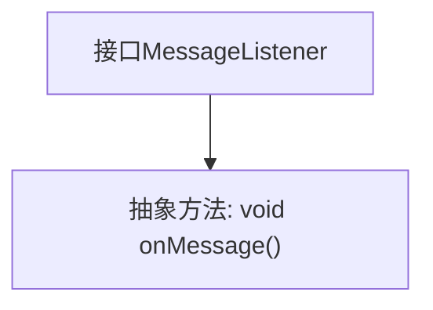

# 基础信息

|      |      |
|------|------|
| 名称 | MessageListener |
| 编码语言 | .java |
| 代码路径 | rabbit-parent/rabbit-api/src/main/java/com/itihub/rabbit/api/MessageListener.java |
| 包名 | com.itihub.rabbit.api |
| 依赖项 | [] |
| 概述说明 | 消息监听接口，定义onMessage方法。 |

# 说明

这是一个名为MessageListener的公开接口，定义了一个无参数无返回值的抽象方法onMessage。该接口可能用于实现消息监听机制，要求实现类必须提供具体的消息处理逻辑。接口设计简洁，仅包含单一功能点，符合单一职责原则。

# 类列表 Class Summary

| 名称   | 类型  | 说明 |
|-------|------|-------------|
| MessageListener | interface | 消息监听接口，定义onMessage方法。 |

## 类 MessageListener

|      |      |
|------|------|
| 访问范围 | public |
| 类型 | interface |
| 名称 | MessageListener |
| 说明 | 消息监听接口，定义onMessage方法。 |

### UML类图

这段类图描述了一个名为MessageListener的接口，该接口定义了一个无参数无返回值的方法onMessage()。作为接口，它使用<<Interface>>标记明确标识，遵循了面向对象设计原则中的接口隔离原则。这个接口可能用于实现观察者模式或回调机制，允许实现类通过onMessage()方法来响应消息事件。类图清晰地展示了接口的结构，为后续具体实现类提供了规范的契约。

### 内部方法调用关系图

这段代码定义了一个名为MessageListener的接口，其中包含一个抽象方法onMessage()。接口用于声明一组方法规范，而不提供具体实现，实现该接口的类必须提供onMessage()方法的具体实现。该流程图清晰地展示了接口与抽象方法之间的层级关系，表明MessageListener接口的唯一功能是声明onMessage()方法，任何实现该接口的类都需要遵循这一规范。

### 字段列表 Field List

| 名称  | 类型  | 说明 |
|-------|-------|------|

### 方法列表 Method List

| 名称  | 类型  | 说明 |
|-------|-------|------|
| onMessage | void | 回调函数，处理消息事件。 |

