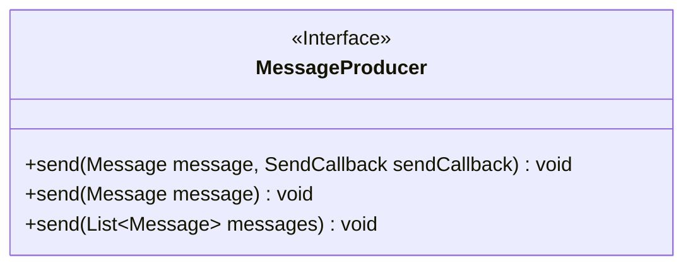
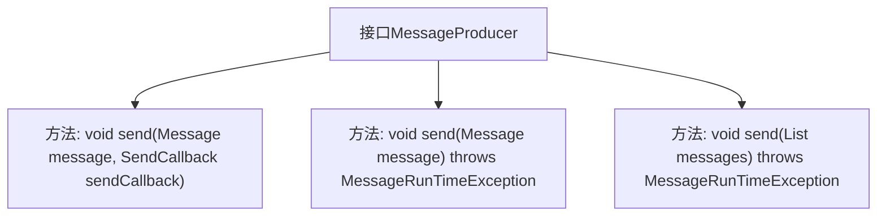

# 基础信息

|      |      |
|------|------|
| 名称 | MessageProducer |
| 编码语言 | .java |
| 代码路径 | rabbit-parent/rabbit-api/src/main/java/com/itihub/rabbit/api/MessageProducer.java |
| 包名 | com.itihub.rabbit.api |
| 依赖项 | ['com.itihub.rabbit.exception.MessageRunTimeException', 'java.util.List'] |
| 概述说明 | 消息生产者接口，支持单条、批量发送及回调处理。 |

# 说明

该接口定义了消息生产者的核心功能，包含三个关键方法。第一个方法支持异步发送消息并通过SendCallback回调处理响应逻辑。第二个方法用于同步发送单条消息，可能抛出MessageRunTimeException异常。第三个方法实现批量消息发送功能，同样可能抛出MessageRunTimeException异常。所有方法均以Message对象作为基础参数，提供了灵活的消息传递机制。接口设计兼顾单条与批量处理、同步与异步模式，为消息发送场景提供了完整解决方案。

# 类列表 Class Summary

| 名称   | 类型  | 说明 |
|-------|------|-------------|
| MessageProducer | interface | 消息生产者接口，支持单条、批量发送及回调处理。 |

## 类 MessageProducer

|      |      |
|------|------|
| 访问范围 | public |
| 类型 | interface |
| 名称 | MessageProducer |
| 说明 | 消息生产者接口，支持单条、批量发送及回调处理。 |

### UML类图

这段代码定义了一个消息生产者接口`MessageProducer`，它提供了三种消息发送方式：带回调的异步发送、同步发送以及批量发送。接口使用`<<Interface>>`标记，所有方法均为公有抽象方法。其中批量发送方法使用了泛型`List~Message~`来接收消息集合，同步相关方法会抛出`MessageRunTimeException`异常。该接口设计灵活，支持不同场景下的消息发送需求，是消息中间件中的核心生产者契约。

### 内部方法调用关系图

这段代码定义了一个名为MessageProducer的接口，该接口提供了三种消息发送的方法。第一种方法send(Message message, SendCallback sendCallback)允许在发送消息时附带一个回调函数SendCallback，用于处理发送后的业务逻辑。第二种方法send(Message message)用于单条消息的发送，可能会抛出MessageRunTimeException异常。第三种方法send(List<Message> messages)支持批量发送消息列表，同样可能抛出MessageRunTimeException异常。这三种方法共同构成了一个灵活的消息生产者接口，适用于不同的消息发送场景。

### 字段列表 Field List

| 名称  | 类型  | 说明 |
|-------|-------|------|

### 方法列表 Method List

| 名称  | 类型  | 说明 |
|-------|-------|------|
| send | void | 发送消息，可能抛出运行时异常。 |
| send | void | 发送消息并回调结果。 |
| send | void | 发送消息列表，可能抛出运行时异常。 |

