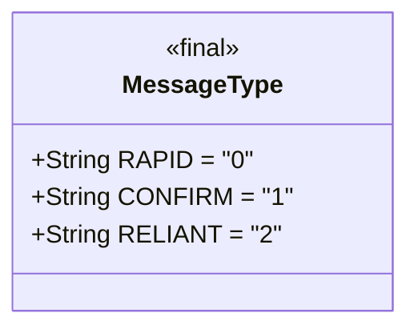
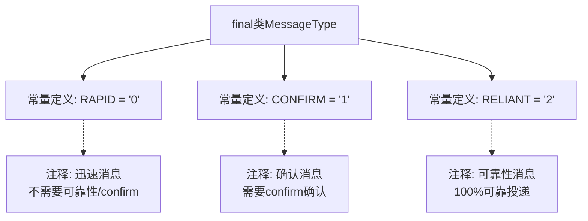

# 基础信息

|      |      |
|------|------|
| 名称 | MessageType |
| 编码语言 | .java |
| 代码路径 | rabbit-parent/rabbit-api/src/main/java/com/itihub/rabbit/api/MessageType.java |
| 包名 | com.itihub.rabbit.api |
| 依赖项 | [] |
| 概述说明 | 消息类型：RAPID(0)无需确认；CONFIRM(1)需确认；RELIANT(2)保证可靠。 |

# 说明

该内容定义了一个名为MessageType的final类，包含三种消息类型的常量字符串。RAPID类型值为0，表示迅速消息，不保证可靠性和确认。CONFIRM类型值为1，表示确认消息，不保证可靠性但需要确认。RELIANT类型值为2，表示可靠性消息，要求100%可靠投递，确保数据库与消息的原子性最终一致。

# 类列表 Class Summary

| 名称   | 类型  | 说明 |
|-------|------|-------------|
| MessageType | class | 消息类型：RAPID(0)无需确认；CONFIRM(1)需确认；RELIANT(2)确保可靠。 |

## 类 MessageType

|      |      |
|------|------|
| 访问范围 | public final |
| 类型 | class |
| 名称 | MessageType |
| 说明 | 消息类型：RAPID(0)无需确认；CONFIRM(1)需确认；RELIANT(2)确保可靠。 |

### UML类图

该代码定义了一个不可继承的MessageType类，包含三个静态常量字符串，分别表示三种消息类型：RAPID（迅速消息，无需确认）、CONFIRM（确认消息，需确认但无需可靠性保证）、RELIANT（可靠性消息，要求100%可靠投递）。这些常量用于区分不同级别的消息处理策略，适用于需要差异化消息可靠性和确认机制的消息系统场景。类设计为final确保类型安全，常量命名清晰表达了各自的语义特征。

### 内部方法调用关系图

该流程图展示了MessageType类的结构，这是一个不可继承的final类，包含三个静态常量定义：RAPID、CONFIRM和RELIANT，分别对应三种消息类型。每个常量都附带有详细的注释说明其特性，包括是否需要保证消息可靠性、是否需要进行confirm确认等。RAPID类型消息不需要任何确认，CONFIRM类型需要确认但不需要保证可靠性，而RELIANT类型则要求100%可靠投递。流程图清晰地呈现了类与常量之间的包含关系以及注释与常量的关联关系。

### 字段列表 Field List

| 名称  | 类型  | 说明 |
|-------|-------|------|
| RAPID = "0" | String | 静态常量RAPID值为"0"。 |
| CONFIRM = "1" | String | 常量CONFIRM值为"1"。 |
| RELIANT = "2" | String | 静态常量RELIANT值为"2"。 |

### 方法列表 Method List

| 名称  | 类型  | 说明 |
|-------|-------|------|

