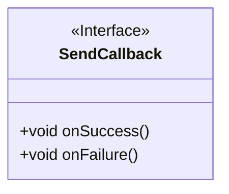
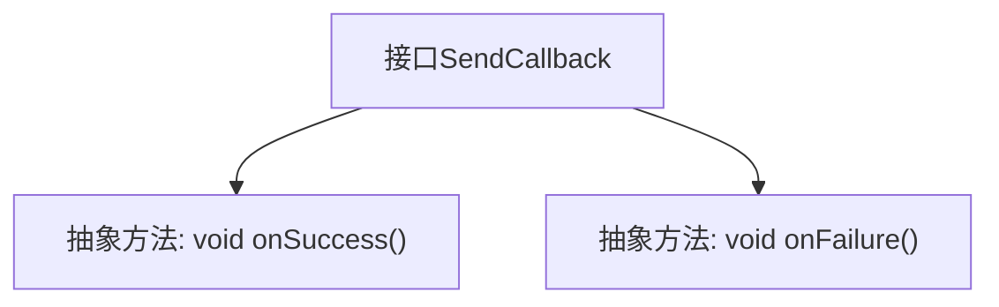

# 基础信息

|      |      |
|------|------|
| 名称 | SendCallback |
| 编码语言 | .java |
| 代码路径 | rabbit-parent/rabbit-api/src/main/java/com/itihub/rabbit/api/SendCallback.java |
| 包名 | com.itihub.rabbit.api |
| 依赖项 | [] |
| 概述说明 | 发送回调接口，包含成功和失败方法。 |

# 说明

这是一个名为SendCallback的公共接口，定义了两个方法：onSuccess和onFailure。该接口用于处理发送操作的回调，当发送成功时调用onSuccess方法，发送失败时调用onFailure方法。接口不包含任何实现细节，仅声明了这两个无参数无返回值的方法。

# 类列表 Class Summary

| 名称   | 类型  | 说明 |
|-------|------|-------------|
| SendCallback | interface | 发送回调接口：定义成功和失败方法。 |

## 类 SendCallback

|      |      |
|------|------|
| 访问范围 | public |
| 类型 | interface |
| 名称 | SendCallback |
| 说明 | 发送回调接口：定义成功和失败方法。 |

### UML类图

这段代码定义了一个名为SendCallback的接口，该接口包含两个抽象方法：onSuccess()和onFailure()，分别用于处理操作成功和失败时的回调逻辑。接口通过<<Interface>>标记明确标识，不包含任何实现细节，强制要求实现类必须提供这两个方法的实现。这种设计模式常用于异步操作或事件驱动的编程场景，允许调用方在操作完成后获得通知并执行相应处理。

### 内部方法调用关系图

这段流程图展示了SendCallback接口的结构，该接口定义了两个未实现的抽象方法：onSuccess()和onFailure()。这两个方法分别用于处理操作成功和失败时的回调逻辑。接口作为契约，强制实现类必须提供这两个方法的实现，适用于异步操作或事件驱动的编程场景。图中清晰地反映了接口与方法的从属关系，符合面向对象的设计原则。

### 字段列表 Field List

| 名称  | 类型  | 说明 |
|-------|-------|------|

### 方法列表 Method List

| 名称  | 类型  | 说明 |
|-------|-------|------|
| onSuccess | void | 成功回调函数。 |
| onFailure | void | 失败回调函数 |

