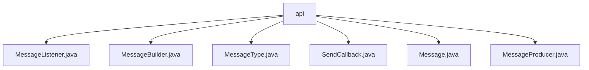

# 基础信息

|      |      |
|------|------|
| 名称 | api |
| 编码语言 | .java |
| 代码路径 | rabbit-parent/rabbit-api/src/main/java/com/itihub/rabbit/api |
| 包名 | rabbit-parent.docs.rabbit-api.src.main.java.com.itihub.rabbit.api |
| 概述说明 | 消息监听接口、建造者模式消息类、消息类型枚举、发送回调接口、可序列化消息类、生产者接口。 |

# 说明

## 概述  
该代码模块是一个基于RabbitMQ的消息通信API，主要提供消息构建、发送、监听等核心功能。模块采用建造者模式灵活构建消息对象，支持多种消息类型（迅速消息、确认消息、可靠性消息）和发送模式（同步/异步、单条/批量），并通过回调接口处理发送结果。整体设计遵循单一职责原则，接口简洁且功能明确。

## 主要业务场景  
1. **消息构建**  
   - 使用`MessageBuilder`通过链式调用配置消息ID、主题、路由规则、延迟参数等属性，支持自动生成消息ID和必填字段校验。  
   - 通过`MessageType`区分消息的可靠性级别（如迅速消息无需确认，可靠性消息需保证原子性投递）。  

2. **消息发送**  
   - **异步发送**：通过`MessageProducer`的异步方法结合`SendCallback`回调处理成功/失败逻辑。  
   - **同步发送**：支持单条或批量消息同步发送，异常时抛出`MessageRunTimeException`。  

3. **消息监听**  
   - 实现`MessageListener`接口的`onMessage`方法，自定义消息到达后的处理逻辑。  

4. **消息模型**  
   - `Message`类封装消息实体，包含主题、路由键、延迟时间等字段，支持序列化传输。  

**典型应用**：  
- 需要可靠投递的订单支付通知（RELIANT类型）。  
- 高吞吐但允许丢失的日志收集（RAPID类型）。  
- 延迟任务调度（通过`delayMills`配置延迟时间）。

### 包内部结构视图

该流程图展示了rabbit-api模块下的核心消息处理类结构。所有Java文件都直接位于api节点下，包括消息监听器、构建器、类型枚举、回调接口、消息实体和生产者等核心组件，形成一个扁平化的消息处理API结构。这些类共同构成了Rabbit消息系统的编程接口层。

# 文件列表 File List

| 名称   | 类型  | 说明 |
|-------|------|-------------|
| [MessageProducer.java](MessageProducer.md) | file | 消息生产者接口，支持单条、批量发送及回调处理。 |
| [Message.java](Message.md) | file | 消息类，含ID、主题、路由键、属性、延迟配置和类型。 |
| [SendCallback.java](SendCallback.md) | file | 发送回调接口，包含成功和失败方法。 |
| [MessageType.java](MessageType.md) | file | 消息类型：RAPID(0)无需确认；CONFIRM(1)需确认；RELIANT(2)保证可靠。 |
| [MessageBuilder.java](MessageBuilder.md) | file | 消息构建类，含ID、主题、路由、属性、延迟和类型配置。 |
| [MessageListener.java](MessageListener.md) | file | 消息监听接口，定义onMessage方法。 |

