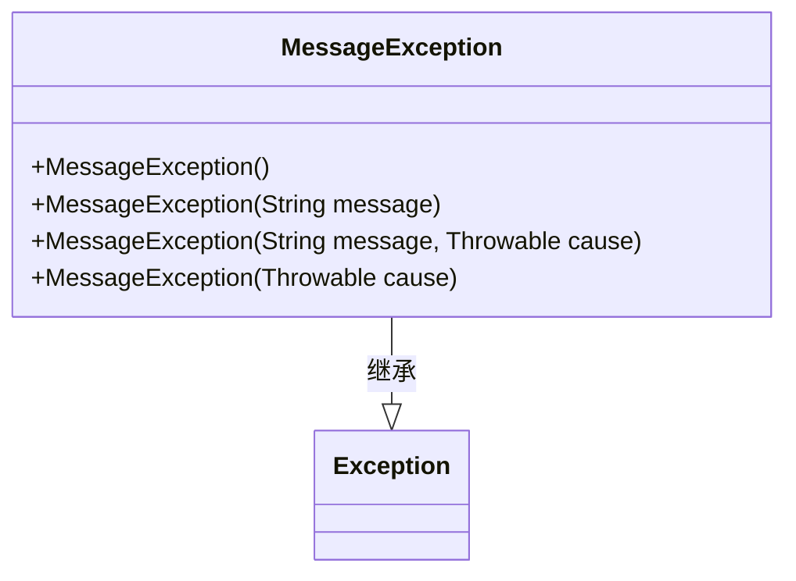
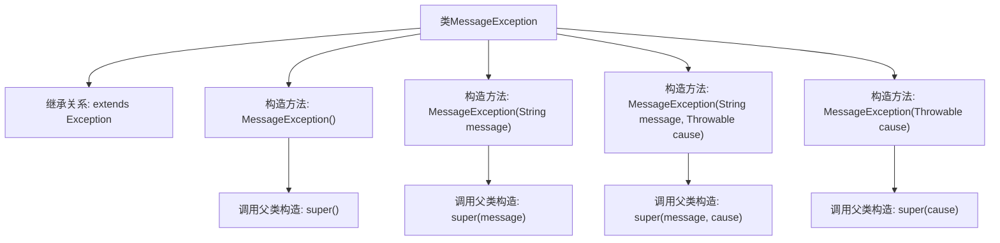

# 基础信息

|      |      |
|------|------|
| 名称 | MessageException |
| 编码语言 | .java |
| 代码路径 | rabbit-parent/rabbit-api/src/main/java/com/itihub/rabbit/exception/MessageException.java |
| 包名 | com.itihub.rabbit.exception |
| 依赖项 | [] |
| 概述说明 | 自定义异常类MessageException继承Exception，提供四种构造方法。 |

# 说明

这是一个名为MessageException的自定义异常类，继承自Java的Exception类。该类提供了四种构造函数：无参构造函数调用父类无参构造；带消息参数的构造函数传递消息给父类；带消息和原因参数的构造函数同时传递消息和异常原因；带原因参数的构造函数仅传递异常原因。这些构造函数允许灵活地创建包含不同信息的异常实例。

# 类列表 Class Summary

| 名称   | 类型  | 说明 |
|-------|------|-------------|
| MessageException | class | 自定义异常类MessageException，继承Exception，提供四种构造方法。 |

## 类 MessageException

|      |      |
|------|------|
| 访问范围 | public |
| 类型 | class |
| 名称 | MessageException |
| 说明 | 自定义异常类MessageException，继承Exception，提供四种构造方法。 |

### UML类图

这段代码定义了一个`MessageException`类，继承自Java标准库中的`Exception`类。该类提供了四种构造函数，分别支持无参构造、仅消息构造、消息与原因构造以及仅原因构造。作为异常类，它主要用于封装错误信息，并通过继承关系获得标准异常处理能力。类图清晰地展示了继承层次和构造方法的重载关系。

### 内部方法调用关系图

这段代码定义了一个继承自Exception的自定义异常类MessageException，包含四个重载构造方法。所有构造方法均调用父类Exception的对应构造方法，分别支持无参、仅消息、消息+原因链、仅原因链四种异常初始化方式。流程图清晰展示了类继承关系和构造方法的调用链，每个构造方法都正确映射到对应的父类super调用。

### 字段列表 Field List

| 名称  | 类型  | 说明 |
|-------|-------|------|

### 方法列表 Method List

| 名称  | 类型  | 说明 |
|-------|-------|------|

