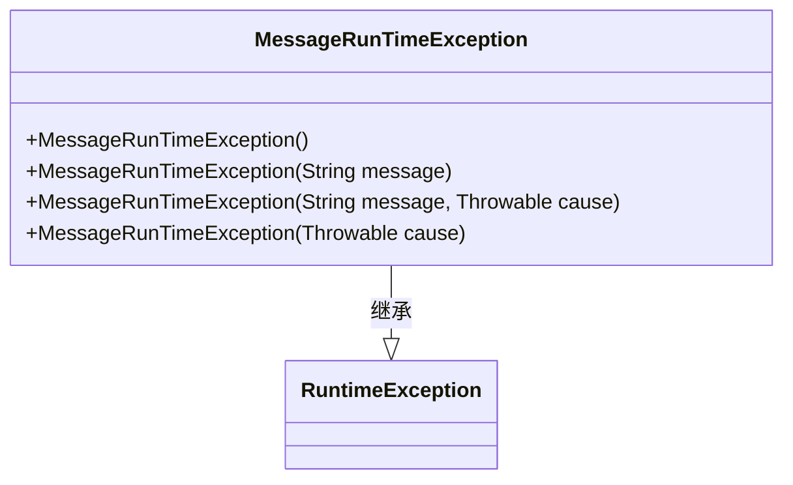
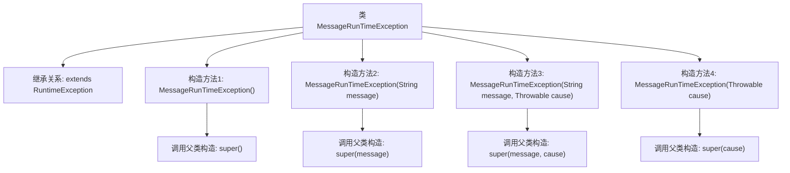

# 基础信息

|      |      |
|------|------|
| 名称 | MessageRunTimeException |
| 编码语言 | .java |
| 代码路径 | rabbit-parent/rabbit-api/src/main/java/com/itihub/rabbit/exception/MessageRunTimeException.java |
| 包名 | com.itihub.rabbit.exception |
| 依赖项 | [] |
| 概述说明 | 自定义运行时异常类，支持多种构造方法。 |

# 说明

这段内容描述了一个名为MessageRunTimeException的自定义异常类，它继承自Java的RuntimeException类。该类提供了四种构造函数：无参构造函数、带消息参数的构造函数、带消息和原因参数的构造函数，以及带原因参数的构造函数。这些构造函数分别调用了父类的相应构造函数，用于创建不同场景下的运行时异常实例。

# 类列表 Class Summary

| 名称   | 类型  | 说明 |
|-------|------|-------------|
| MessageRunTimeException | class | 自定义运行时异常类，支持多种构造方法。 |

## 类 MessageRunTimeException

|      |      |
|------|------|
| 访问范围 | public |
| 类型 | class |
| 名称 | MessageRunTimeException |
| 说明 | 自定义运行时异常类，支持多种构造方法。 |

### UML类图

类图描述：MessageRunTimeException是一个自定义运行时异常类，继承自Java标准库中的RuntimeException。它提供了四种构造函数，分别支持无参构造、仅消息构造、消息与原因构造以及仅原因构造，完全覆盖了父类的异常构造模式。这种设计允许调用方灵活地创建包含不同信息的异常实例，同时保持了与标准异常体系的一致性。

### 内部方法调用关系图

这段流程图展示了MessageRunTimeException类的结构及其与父类RuntimeException的继承关系。该类定义了4个重载构造方法，分别对应无参、仅含消息、消息与原因、仅含原因四种异常初始化场景。每个构造方法都通过super关键字调用父类对应的构造方法，实现了异常信息的传递和封装。流程图清晰呈现了类层次结构和构造方法的调用链，适用于需要自定义运行时异常的场景。

### 字段列表 Field List

| 名称  | 类型  | 说明 |
|-------|-------|------|

### 方法列表 Method List

| 名称  | 类型  | 说明 |
|-------|-------|------|

