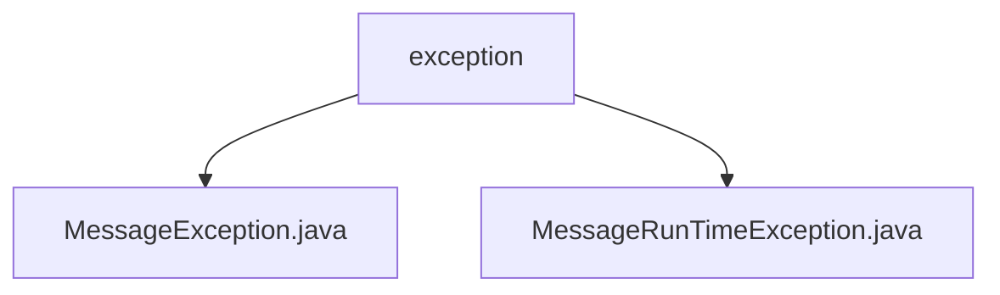

# 基础信息

|      |      |
|------|------|
| 名称 | exception |
| 编码语言 | .java |
| 代码路径 | rabbit-parent/rabbit-api/src/main/java/com/itihub/rabbit/exception |
| 包名 | rabbit-parent.docs.rabbit-api.src.main.java.com.itihub.rabbit.exception |
| 概述说明 | 自定义异常类MessageException和MessageRunTimeException，分别继承Exception和RuntimeException，提供四种构造函数。 |

# 说明

## 概述  
该代码模块包含两个自定义异常类：`MessageException` 和 `MessageRunTimeException`，均位于 `rabbit-parent/rabbit-api` 模块的 `com.itihub.rabbit.exception` 包中。这两个类分别继承自 Java 标准库的 `Exception` 和 `RuntimeException`，用于在业务逻辑中处理异常场景。  

- **MessageException**：继承自 `Exception`，属于受检异常（Checked Exception），需显式捕获或声明抛出。  
- **MessageRunTimeException**：继承自 `RuntimeException`，属于非受检异常（Unchecked Exception），通常用于表示不可恢复的系统错误或编程错误。  

两个类均提供了四种构造函数，支持灵活地传递异常信息（消息）和原因（底层异常），便于在不同场景下创建异常实例。  

## 主要业务场景  
1. **受检异常处理**（`MessageException`）：  
   - 适用于需要调用方显式处理的业务异常，例如消息处理失败、参数校验不合法等场景。  
   - 通过构造函数传递自定义错误消息或嵌套异常原因，便于定位问题。  

2. **非受检异常处理**（`MessageRunTimeException`）：  
   - 适用于系统级错误或无需强制处理的异常，例如消息队列连接中断、并发冲突等。  
   - 通过构造函数快速封装运行时错误，减少代码中对异常处理的侵入性。  

**共同特点**：  
- 支持无参构造、纯消息构造、消息+原因构造、纯原因构造，覆盖了异常创建的常见需求。  
- 通过继承标准异常类，与 Java 异常处理机制无缝集成。

### 包内部结构视图

该流程图展示了rabbit-api模块中异常处理的层级结构。根节点为exception文件夹，包含两个子节点：MessageException.java和MessageRunTimeException.java，分别表示自定义的消息异常类和运行时异常类。这种结构清晰地体现了异常类的组织方式，符合标准Java项目的包管理规范。

# 文件列表 File List

| 名称   | 类型  | 说明 |
|-------|------|-------------|
| [MessageException.java](MessageException.md) | file | 自定义异常类MessageException继承Exception，提供四种构造方法。 |
| [MessageRunTimeException.java](MessageRunTimeException.md) | file | 自定义运行时异常类，支持多种构造方法。 |

