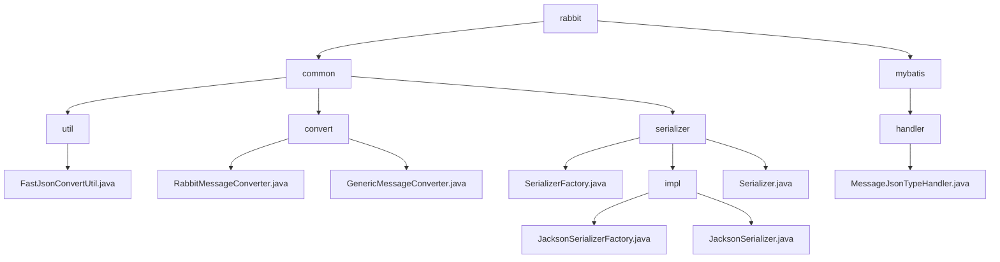

# 基础信息

|      |      |
|------|------|
| 名称 | rabbit |
| 编码语言 | .java |
| 代码路径 | rabbit-parent/rabbit-common/src/main/java/com/itihub/rabbit |
| 包名 | rabbit-parent.docs.rabbit-common.src.main.java.com.itihub.rabbit |
| 概述说明 | FastJson工具类实现JSON与Java对象互转。RabbitMQ消息转换模块处理延迟消息和通用序列化。Jackson序列化工具支持JSON处理。MyBatis类型处理器实现Message与JSON互转。 |

# 说明

# RabbitMQ 消息处理模块总结

## 概述

该模块是一个完整的RabbitMQ消息处理工具集，提供从消息序列化到数据库存储的全套解决方案。模块采用分层设计，包含以下核心组件：

1. **消息转换层**  
   - RabbitMessageConverter：处理消息转换的高级封装，支持延迟消息
   - GenericMessageConverter：基础消息转换实现，依赖Serializer接口

2. **序列化层**  
   - SerializerFactory接口与JacksonSerializerFactory实现：工厂模式创建序列化器
   - Serializer接口与JacksonSerializer实现：基于Jackson的序列化核心实现
   - FastJsonConvertUtil：JSON与Java对象转换的实用工具类

3. **数据持久化层**  
   - MessageJsonTypeHandler：MyBatis类型处理器，处理Message类与数据库JSON的转换

## 主要业务场景

1. **消息队列全流程处理**  
   - 生产者端：将业务对象序列化为消息体，支持延迟投递
   - 消费者端：将消息反序列化为业务对象进行处理
   - 消息持久化：将消息以JSON格式存储到数据库

2. **复杂消息转换场景**  
   - 处理泛型消息的序列化/反序列化
   - 支持多种JSON格式处理（含注释、非标准格式等）
   - 消息延迟投递的特殊处理

3. **数据持久化场景**  
   - 实现Message对象与数据库JSON字段的自动转换
   - 通过MyBatis类型处理器简化ORM映射

4. **高兼容性设计场景**  
   - 工厂模式支持多种序列化实现
   - 代理模式实现功能扩展
   - 完善的异常处理和日志记录机制

5. **性能优化场景**  
   - 单例模式管理序列化资源
   - 预配置优化的ObjectMapper实例
   - 高效的JSON处理工具类

### 包内部结构视图

该流程图展示了rabbit-common模块的Java包结构，从根目录rabbit开始分为common和mybatis两大分支。common下包含util工具类、convert转换器和serializer序列化器三个子模块，其中serializer又细分为接口、工厂类和具体实现类。mybatis分支则包含一个type handler处理器。整个结构清晰地反映了消息处理相关组件的分层架构。

# 文件列表 File List

| 名称   | 类型  | 说明 |
|-------|------|-------------|
| [common](common/_module.md) | package | FastJson工具类实现JSON与Java对象互转。RabbitMQ消息转换模块处理延迟消息和通用序列化。Jackson序列化工具支持JSON处理。MyBatis类型处理器实现Message与JSON互转。 |

