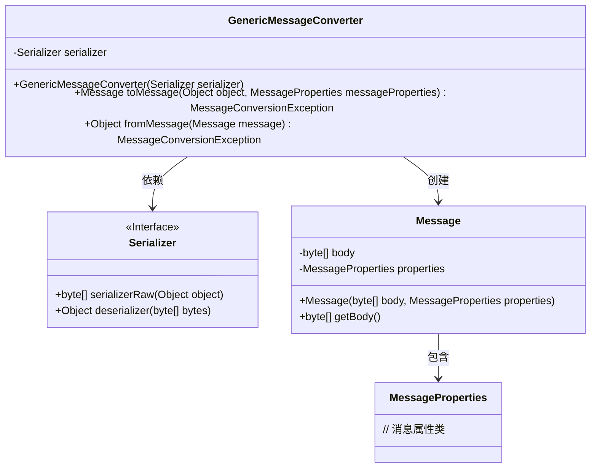
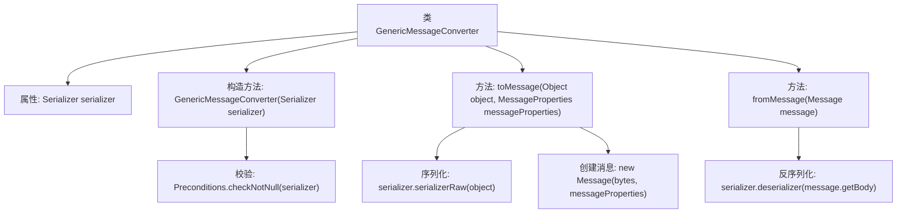

# 基础信息

|      |      |
|------|------|
| 名称 | GenericMessageConverter |
| 编码语言 | .java |
| 代码路径 | rabbit-parent/rabbit-common/src/main/java/com/itihub/rabbit/common/convert/GenericMessageConverter.java |
| 包名 | com.itihub.rabbit.common.convert |
| 依赖项 | ['com.google.common.base.Preconditions', 'com.itihub.rabbit.common.serializer.Serializer', 'org.springframework.amqp.core.Message', 'org.springframework.amqp.core.MessageProperties', 'org.springframework.amqp.support.converter.MessageConversionException', 'org.springframework.amqp.support.converter.MessageConverter'] |
| 概述说明 | GenericMessageConverter类实现MessageConverter接口，使用序列化器转换消息对象。 |

# 说明

GenericMessageConverter是一个实现了MessageConverter接口的类，用于消息与对象之间的转换。它依赖一个Serializer接口实例进行序列化和反序列化操作。构造函数接收非空的Serializer实例并初始化。toMessage方法将对象序列化为字节数组并封装成Message对象返回。fromMessage方法将Message对象的字节内容反序列化为原始对象。该类通过委托Serializer实现核心转换逻辑。

# 类列表 Class Summary

| 名称   | 类型  | 说明 |
|-------|------|-------------|
| GenericMessageConverter | class | 通用消息转换器，使用序列化器处理对象与消息间的转换。 |

## 类 GenericMessageConverter

|      |      |
|------|------|
| 访问范围 | public |
| 类型 | class |
| 名称 | GenericMessageConverter |
| 说明 | 通用消息转换器，使用序列化器处理对象与消息间的转换。 |

### UML类图

这段代码展示了一个消息转换系统，其中GenericMessageConverter类实现了消息与对象之间的双向转换功能。该类依赖于Serializer接口进行序列化/反序列化操作，并使用Message类封装二进制数据和消息属性。类图清晰地展示了各组件之间的关系：转换器通过序列化器处理数据，生成包含消息体和属性的Message对象，体现了职责分离的设计原则。整个结构支持灵活的消息处理，同时确保类型安全。

### 内部方法调用关系图

这段代码定义了一个`GenericMessageConverter`类，实现了消息转换功能。流程图展示了类结构，包括构造方法中对序列化器的非空校验，`toMessage`方法中先序列化对象再创建消息的过程，以及`fromMessage`方法中对消息体的反序列化操作。整个流程清晰地反映了消息的编码和解码逻辑，体现了对序列化器的依赖关系。

### 字段列表 Field List

| 名称  | 类型  | 说明 |
|-------|-------|------|
| serializer | Serializer | 私有序列化器实例。 |

### 方法列表 Method List

| 名称  | 类型  | 说明 |
|-------|-------|------|
| toMessage | Message | 将对象序列化为字节数组并创建消息。 |
| fromMessage | Object | Java方法：反序列化消息体为对象。 |

