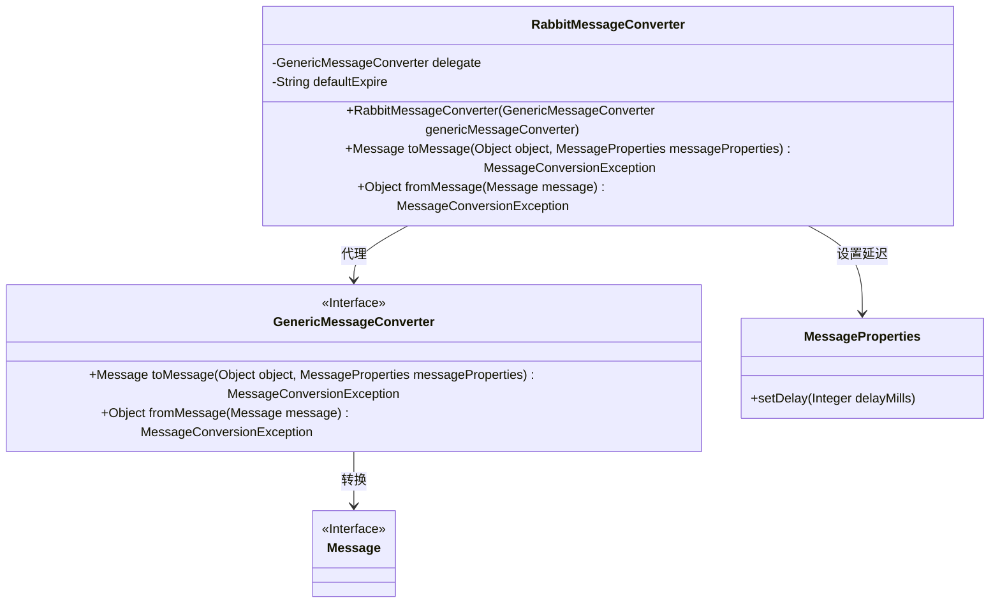
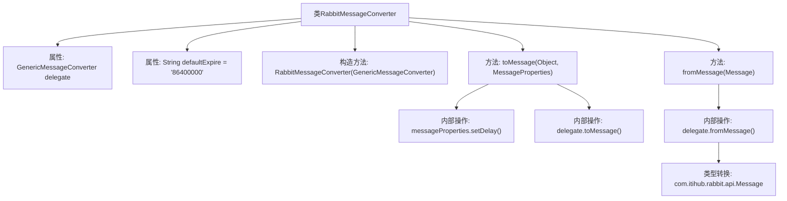

# 基础信息

|      |      |
|------|------|
| 名称 | RabbitMessageConverter |
| 编码语言 | .java |
| 代码路径 | rabbit-parent/rabbit-common/src/main/java/com/itihub/rabbit/common/convert/RabbitMessageConverter.java |
| 包名 | com.itihub.rabbit.common.convert |
| 依赖项 | ['com.google.common.base.Preconditions', 'org.springframework.amqp.core.Message', 'org.springframework.amqp.core.MessageProperties', 'org.springframework.amqp.support.converter.MessageConversionException', 'org.springframework.amqp.support.converter.MessageConverter'] |
| 概述说明 | Rabbit消息转换器，设置延迟时间并代理转换消息。 |

# 说明

RabbitMessageConverter是一个实现了MessageConverter接口的类，用于消息转换。它通过构造函数接收GenericMessageConverter实例作为代理对象。主要功能包括在toMessage方法中设置消息延迟时间（从输入对象获取delayMills值），并委托代理对象完成消息转换；在fromMessage方法中同样通过代理对象将消息转换为特定类型。类中定义了默认过期时间常量但未实际使用。

# 类列表 Class Summary

| 名称   | 类型  | 说明 |
|-------|------|-------------|
| RabbitMessageConverter | class | Rabbit消息转换器，代理模式处理消息延迟和转换。 |

## 类 RabbitMessageConverter

|      |      |
|------|------|
| 访问范围 | public |
| 类型 | class |
| 名称 | RabbitMessageConverter |
| 说明 | Rabbit消息转换器，代理模式处理消息延迟和转换。 |

### UML类图

这段代码展示了一个RabbitMQ消息转换器的实现，通过代理模式委托GenericMessageConverter进行核心消息转换。RabbitMessageConverter类在转换过程中添加了业务逻辑，包括设置消息延迟时间(defaultExpire为默认24小时)。类图中清晰显示了RabbitMessageConverter与GenericMessageConverter接口的代理关系，以及其与Message、MessageProperties的交互。转换器实现了双向转换：toMessage()处理发送消息时的转换，fromMessage()处理接收消息时的转换。

### 内部方法调用关系图

这段代码展示了一个RabbitMQ消息转换器的实现，采用代理模式扩展GenericMessageConverter功能。主要流程包括：1) 构造时注入基础转换器；2) toMessage方法处理消息延迟设置后委托转换；3) fromMessage方法直接委托转换并类型强转。核心特点是维护默认过期时间属性，并通过setDelay方法实现消息延迟投递控制，最后都委托给基础转换器完成实际工作。

### 字段列表 Field List

| 名称  | 类型  | 说明 |
|-------|-------|------|
| defaultExpire = String.valueOf(24 * 60 * 60 * 1000) | String | 私有字符串常量defaultExpire设为24小时毫秒值。 |
| delegate | GenericMessageConverter | 私有成员变量delegate，类型为GenericMessageConverter。 |

### 方法列表 Method List

| 名称  | 类型  | 说明 |
|-------|-------|------|
| toMessage | Message | 重写toMessage方法，设置消息延迟时间后委托处理。 |
| fromMessage | Object | 重写方法，将消息转换为特定类型并返回。 |

