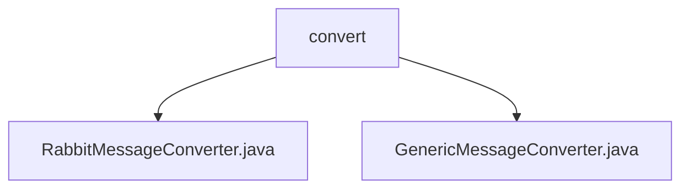

# 基础信息

|      |      |
|------|------|
| 名称 | convert |
| 编码语言 | .java |
| 代码路径 | rabbit-parent/rabbit-common/src/main/java/com/itihub/rabbit/common/convert |
| 包名 | rabbit-parent.docs.rabbit-common.src.main.java.com.itihub.rabbit.common.convert |
| 概述说明 | RabbitMessageConverter实现消息转换，支持延迟设置。GenericMessageConverter通过序列化器处理对象与消息转换。 |

# 说明

# RabbitMQ 消息转换模块总结

## 概述

该模块是一个用于 RabbitMQ 消息转换的工具集，主要包含两个核心类：

1. **RabbitMessageConverter**  
   实现了 MessageConverter 接口，作为消息转换的高级封装。它通过代理模式委托 GenericMessageConverter 完成核心转换逻辑，并在此基础上添加了消息延迟时间的处理功能。

2. **GenericMessageConverter**  
   同样实现了 MessageConverter 接口，是基础的消息转换实现。它依赖于 Serializer 接口来完成实际的序列化和反序列化操作，提供了对象与消息之间的双向转换能力。

## 主要业务场景

该模块设计用于以下典型业务场景：

1. **延迟消息处理**  
   RabbitMessageConverter 专门处理带有延迟时间(delayMills)的消息，在消息转换过程中自动设置延迟属性，适用于需要定时/延迟投递消息的场景。

2. **通用消息转换**  
   GenericMessageConverter 提供通用的序列化/反序列化能力，支持各种类型对象与消息体之间的转换，适用于大多数需要对象序列化传输的 RabbitMQ 使用场景。

3. **可扩展的序列化机制**  
   通过依赖 Serializer 接口，允许业务方灵活选择不同的序列化实现(如JSON、Protobuf等)，满足不同性能和数据格式的需求。

4. **代理模式应用**  
   RabbitMessageConverter 通过代理 GenericMessageConverter 实现功能扩展，这种设计模式使得核心转换逻辑与附加功能(如延迟处理)解耦，便于维护和扩展。

### 包内部结构视图

该流程图展示了rabbit-common项目中convert目录下的文件结构关系。convert作为父目录，包含两个Java类文件：RabbitMessageConverter和GenericMessageConverter。这两个文件都直接隶属于convert目录，没有更深层次的嵌套结构，形成了简单的两级目录关系。图表清晰地反映了消息转换器模块的核心组件构成。

# 文件列表 File List

| 名称   | 类型  | 说明 |
|-------|------|-------------|
| [RabbitMessageConverter.java](RabbitMessageConverter.md) | file | Rabbit消息转换器，设置延迟时间并代理转换消息。 |
| [GenericMessageConverter.java](GenericMessageConverter.md) | file | GenericMessageConverter类实现MessageConverter接口，使用序列化器转换消息对象。 |

