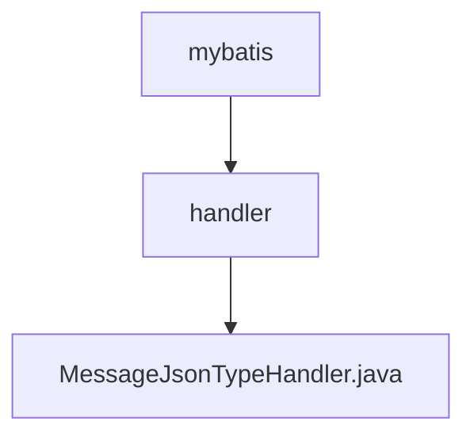

# 基础信息

|      |      |
|------|------|
| 名称 | mybatis |
| 编码语言 | .java |
| 代码路径 | rabbit-parent/rabbit-common/src/main/java/com/itihub/rabbit/common/mybatis |
| 包名 | rabbit-parent.docs.rabbit-common.src.main.java.com.itihub.rabbit.common.mybatis |
| 概述说明 | MessageJsonTypeHandler处理Message对象与JSON的数据库读写转换。 |

# 说明

MessageJsonTypeHandler是一个继承自BaseTypeHandler的自定义类型处理器，用于处理Message类与数据库之间的JSON格式转换。它实现了四个核心方法：setNonNullParameter将Message对象转换为JSON字符串并存入PreparedStatement；三个getNullableResult方法分别从ResultSet的列名/列索引和CallableStatement中获取JSON字符串，若非空则转换为Message对象，否则返回null。所有方法都通过FastJsonConvertUtil工具类实现JSON与对象的互转。

### 包内部结构视图

该流程图展示了rabbit-common项目中mybatis模块的层级结构。顶层是mybatis目录，其下包含handler子目录，handler目录中包含MessageJsonTypeHandler.java文件。这种结构体现了MyBatis类型处理器的典型组织方式，其中核心处理类被放置在专门的handler包中。

# 文件列表 File List

| 名称   | 类型  | 说明 |
|-------|------|-------------|
| [handler](handler/_module.md) | package | MessageJsonTypeHandler处理Message对象与JSON的数据库读写转换。 |

