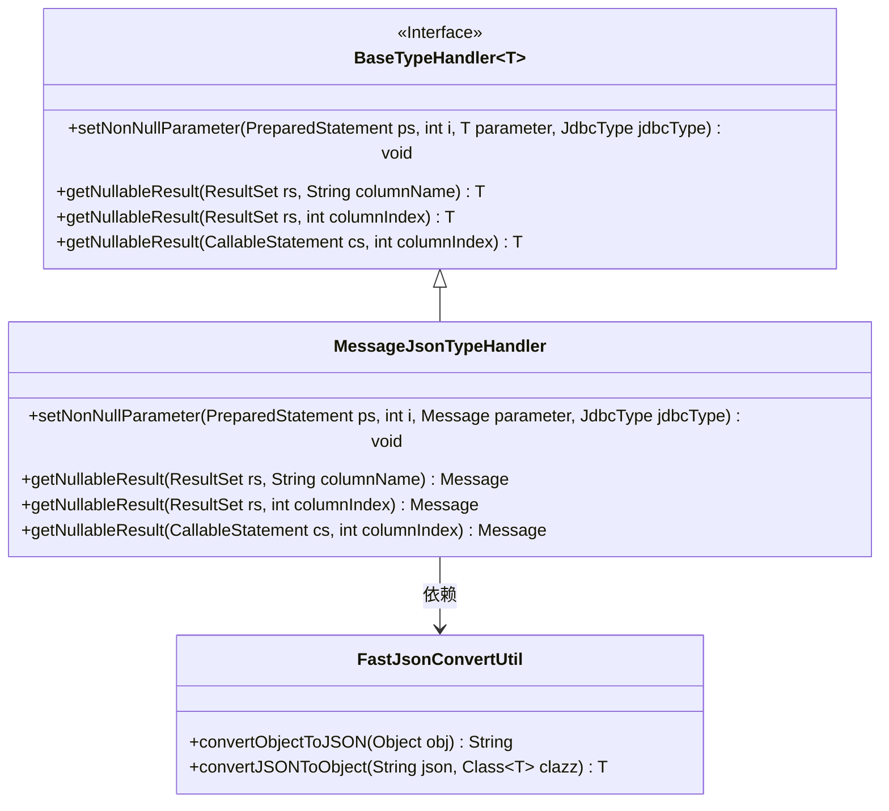
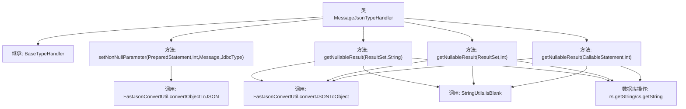

# 基础信息

|      |      |
|------|------|
| 名称 | MessageJsonTypeHandler |
| 编码语言 | .java |
| 代码路径 | rabbit-parent/rabbit-common/src/main/java/com/itihub/rabbit/common/mybatis/handler/MessageJsonTypeHandler.java |
| 包名 | com.itihub.rabbit.common.mybatis.handler |
| 依赖项 | ['com.itihub.rabbit.api.Message', 'com.itihub.rabbit.common.util.FastJsonConvertUtil', 'org.apache.commons.lang3.StringUtils', 'org.apache.ibatis.type.BaseTypeHandler', 'org.apache.ibatis.type.JdbcType', 'java.sql.CallableStatement', 'java.sql.PreparedStatement', 'java.sql.ResultSet', 'java.sql.SQLException'] |
| 概述说明 | MessageJsonTypeHandler处理Message对象与JSON的数据库读写转换。 |

# 说明

MessageJsonTypeHandler是一个继承自BaseTypeHandler的自定义类型处理器，用于处理Message类与数据库之间的JSON格式转换。它实现了四个核心方法：setNonNullParameter将Message对象转换为JSON字符串并存入PreparedStatement；三个getNullableResult方法分别从ResultSet的列名/列索引和CallableStatement中获取JSON字符串，若非空则转换为Message对象，否则返回null。所有方法都通过FastJsonConvertUtil工具类实现JSON与对象的互转。

# 类列表 Class Summary

| 名称   | 类型  | 说明 |
|-------|------|-------------|
| MessageJsonTypeHandler | class | MessageJsonTypeHandler处理Message对象与JSON的数据库读写转换。 |

## 类 MessageJsonTypeHandler

|      |      |
|------|------|
| 访问范围 | public |
| 类型 | class |
| 名称 | MessageJsonTypeHandler |
| 说明 | MessageJsonTypeHandler处理Message对象与JSON的数据库读写转换。 |

### UML类图

类图描述：MessageJsonTypeHandler继承自泛型接口BaseTypeHandler，专门处理Message类的JSON类型转换。它通过FastJsonConvertUtil工具类实现数据库字段与Message对象之间的JSON序列化/反序列化，覆盖了父接口的四个核心方法，分别处理PreparedStatement参数设置和三种不同场景的结果集取值，对空值和非空字符串进行了安全判断。

### 内部方法调用关系图

该流程图展示了MessageJsonTypeHandler类的核心结构和数据流转过程。该类继承自BaseTypeHandler，专门处理Message对象的JSON类型转换，包含4个主要方法：1个用于设置非空参数，3个用于处理可空结果集。所有数据库交互方法都通过FastJsonConvertUtil工具类实现JSON与对象的双向转换，并采用StringUtils进行空值校验，确保数据安全性和类型一致性。流程清晰展现了从数据库操作到JSON转换的完整处理链。

### 字段列表 Field List

| 名称  | 类型  | 说明 |
|-------|-------|------|

### 方法列表 Method List

| 名称  | 类型  | 说明 |
|-------|-------|------|
| setNonNullParameter | void | 重写方法，将Message对象转为JSON字符串并设置到PreparedStatement中。 |
| getNullableResult | Message | 重写方法：从数据库结果集获取非空消息对象，使用FastJson转换。 |
| getNullableResult | Message | Java方法：从ResultSet获取非空Message对象，使用FastJson转换，空值返回null。 |
| getNullableResult | Message | 重写方法：从CallableStatement获取非空Message对象，使用FastJson转换。 |

