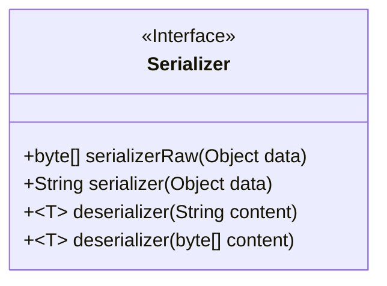
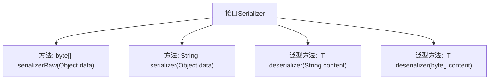

# 基础信息

|      |      |
|------|------|
| 名称 | Serializer |
| 编码语言 | .java |
| 代码路径 | rabbit-parent/rabbit-common/src/main/java/com/itihub/rabbit/common/serializer/Serializer.java |
| 包名 | com.itihub.rabbit.common.serializer |
| 依赖项 | [] |
| 概述说明 | 序列化接口，含对象转字节数组、字符串及反序列化方法。 |

# 说明

这是一个名为Serializer的公共接口，定义了四种序列化和反序列化方法。接口包含两个序列化方法：serializerRaw将对象转为字节数组，serializer将对象转为字符串。还有两个泛型反序列化方法：deserializer可将字符串或字节数组内容还原为指定类型对象。该接口提供了数据转换的基础功能，支持多种格式的序列化操作。

# 类列表 Class Summary

| 名称   | 类型  | 说明 |
|-------|------|-------------|
| Serializer | interface | 序列化接口：支持对象转字节数组和字符串，支持反序列化字符串和字节数组。 |

## 类 Serializer

|      |      |
|------|------|
| 访问范围 | public |
| 类型 | interface |
| 名称 | Serializer |
| 说明 | 序列化接口：支持对象转字节数组和字符串，支持反序列化字符串和字节数组。 |

### UML类图

这段代码定义了一个名为`Serializer`的接口，该接口提供了序列化和反序列化的核心功能。接口包含四个方法：`serializerRaw`将对象序列化为字节数组，`serializer`将对象序列化为字符串，两个重载的`deserializer`方法分别从字符串或字节数组反序列化为泛型对象。该接口设计灵活，支持多种数据格式转换，适用于需要对象持久化或网络传输的场景，通过泛型机制确保类型安全。

### 内部方法调用关系图

该流程图展示了Serializer接口的结构，包含四个核心方法：两个序列化方法（分别返回byte数组和字符串）和两个反序列化泛型方法（分别处理字符串和byte数组输入）。所有方法直接从接口派生，无层级嵌套关系，体现了序列化/反序列化的基础功能契约。接口设计支持多种数据类型转换，泛型方法提供类型安全的逆向操作能力。

### 字段列表 Field List

| 名称  | 类型  | 说明 |
|-------|-------|------|

### 方法列表 Method List

| 名称  | 类型  | 说明 |
|-------|-------|------|
| serializer | String | 序列化对象为字符串的方法。 |
| serializerRaw | byte[] | 序列化对象为字节数组 |
| deserializer | T | 泛型方法，将字符串反序列化为类型T的对象。 |
| deserializer | T | 字节数组反序列化为泛型T的方法。 |

