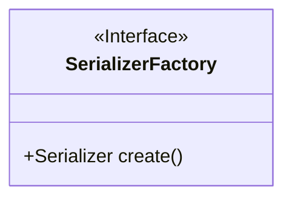
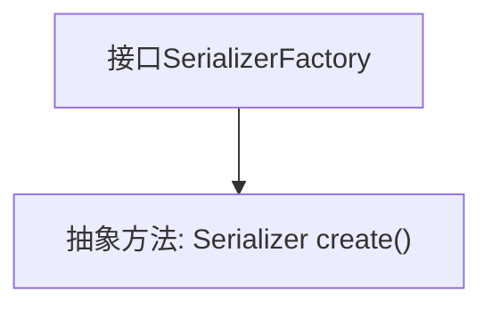

# 基础信息

|      |      |
|------|------|
| 名称 | SerializerFactory |
| 编码语言 | .java |
| 代码路径 | rabbit-parent/rabbit-common/src/main/java/com/itihub/rabbit/common/serializer/SerializerFactory.java |
| 包名 | com.itihub.rabbit.common.serializer |
| 依赖项 | [] |
| 概述说明 | 接口定义序列化工厂，提供创建序列化器方法。 |

# 说明

这是一个公开接口SerializerFactory的定义，它声明了一个无参数方法create，该方法返回一个Serializer类型的实例。该接口用于创建序列化器对象，属于工厂模式的设计实现。

# 类列表 Class Summary

| 名称   | 类型  | 说明 |
|-------|------|-------------|
| SerializerFactory | interface | 接口定义序列化工厂，提供创建序列化器方法。 |

## 类 SerializerFactory

|      |      |
|------|------|
| 访问范围 | public |
| 类型 | interface |
| 名称 | SerializerFactory |
| 说明 | 接口定义序列化工厂，提供创建序列化器方法。 |

### UML类图

这段类图描述了一个名为SerializerFactory的接口，该接口定义了一个工厂方法create()用于创建Serializer对象。作为工厂模式的核心接口，它不包含任何实现细节，仅声明了创建产品对象的抽象方法。图中使用<<Interface>>标记明确表示这是一个接口，且方法为公有抽象方法(用+前缀表示)。该接口与具体实现类之间的关系将在实际使用时通过实现该接口来建立。

### 内部方法调用关系图

这段代码定义了一个名为SerializerFactory的接口，该接口包含一个抽象方法create()，用于创建并返回一个Serializer对象。接口作为工厂模式的抽象层，规定了具体实现类必须提供创建Serializer实例的能力。图中清晰地展示了接口与其唯一方法之间的从属关系，体现了简洁而明确的设计意图。

### 字段列表 Field List

| 名称  | 类型  | 说明 |
|-------|-------|------|

### 方法列表 Method List

| 名称  | 类型  | 说明 |
|-------|-------|------|
| create | Serializer | 创建序列化器实例。 |

