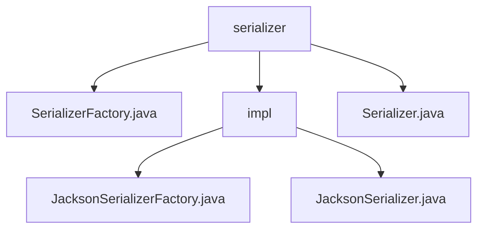

# 基础信息

|      |      |
|------|------|
| 名称 | serializer |
| 编码语言 | .java |
| 代码路径 | rabbit-parent/rabbit-common/src/main/java/com/itihub/rabbit/common/serializer |
| 包名 | rabbit-parent.docs.rabbit-common.src.main.java.com.itihub.rabbit.common.serializer |
| 概述说明 | 公开接口SerializerFactory定义create方法返回Serializer实例，用于创建序列化器，实现工厂模式。 |

# 说明

# 序列化工具模块总结

## 概述

该代码模块是一个基于Jackson库实现的序列化工具集，主要提供JSON格式的消息序列化与反序列化功能。模块采用工厂模式设计，包含以下核心组件：

1. **SerializerFactory接口**：定义工厂模式接口，声明创建序列化器的标准方法
2. **JacksonSerializerFactory实现类**：通过单例模式为特定消息类型生成参数化序列化器
3. **Serializer接口**：定义序列化/反序列化的基础操作契约
4. **JacksonSerializer实现类**：封装Jackson的核心序列化操作

模块设计特点：
- 工厂模式解耦序列化器创建过程
- 单例模式保证资源高效利用
- 预配置优化的ObjectMapper实例
- 完善的异常处理和日志记录机制
- 支持泛型类型的参数化序列化

## 主要业务场景

1. **基础序列化场景**：
   - 将Java对象转换为JSON格式的字节数组(`serializerRaw`)
   - 将Java对象转换为JSON字符串(`serializer`)
   - 适用于消息队列传输、网络通信等需要数据格式转换的场景

2. **基础反序列化场景**：
   - 从JSON字符串还原为指定类型Java对象(`deserializer`)
   - 从字节数组还原为指定类型Java对象(`deserializer`)
   - 适用于接收端消息解析、持久化数据读取等场景

3. **高级JSON处理场景**：
   - 处理非标准JSON格式（含注释、非数值数字、前导零等）
   - 处理未知属性时不报错，提高系统兼容性
   - 适用于需要与第三方系统或异构系统交互的场景

4. **参数化类型处理场景**：
   - 通过`createParametricType`方法处理泛型类型的序列化
   - 适用于需要保持完整类型信息的复杂对象传输
   - 特别适合消息队列中泛型消息的序列化/反序列化

### 包内部结构视图

该流程图展示了rabbit-common项目中serializer模块的层级结构。根节点是serializer目录，包含三个子节点：SerializerFactory.java文件、impl子目录和Serializer.java文件。impl子目录下又包含两个实现类：JacksonSerializerFactory.java和JacksonSerializer.java。整个结构清晰地呈现了序列化模块的核心组件及其实现关系。

# 文件列表 File List

| 名称   | 类型  | 说明 |
|-------|------|-------------|
| [SerializerFactory.java](SerializerFactory.md) | file | 接口定义序列化工厂，提供创建序列化器方法。 |
| [Serializer.java](Serializer.md) | file | 序列化接口，含对象转字节数组、字符串及反序列化方法。 |
| [impl](impl/_module.md) | package | Jackson序列化工具类，含单例工厂和参数化类型处理，支持多种JSON特性与异常处理。 |

