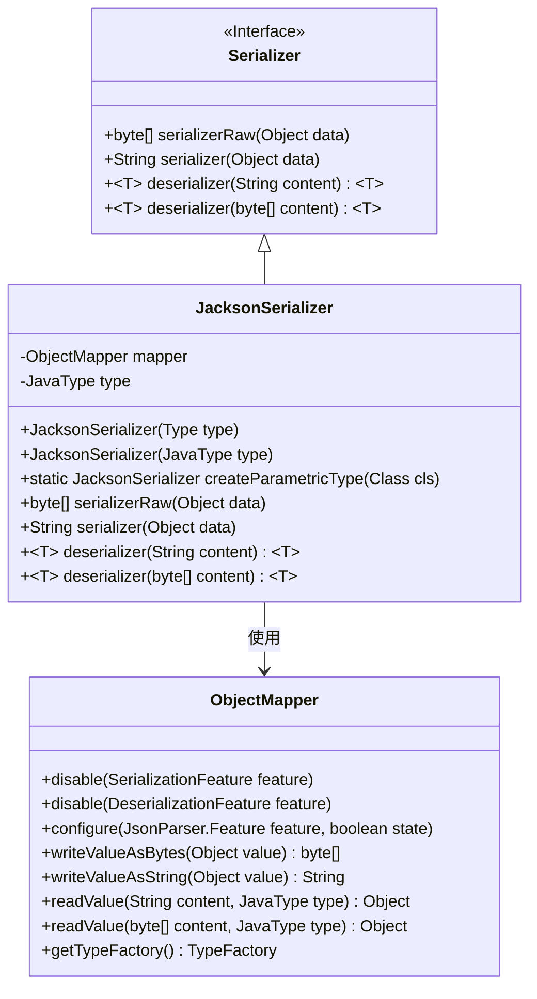
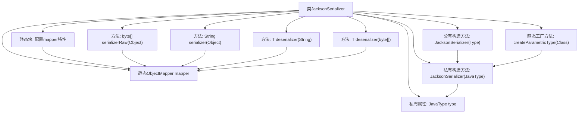

# 基础信息

|      |      |
|------|------|
| 名称 | JacksonSerializer |
| 编码语言 | .java |
| 代码路径 | rabbit-parent/rabbit-common/src/main/java/com/itihub/rabbit/common/serializer/impl/JacksonSerializer.java |
| 包名 | com.itihub.rabbit.common.serializer.impl |
| 依赖项 | ['com.fasterxml.jackson.core.JsonParser', 'com.fasterxml.jackson.core.JsonProcessingException', 'com.fasterxml.jackson.databind.DeserializationFeature', 'com.fasterxml.jackson.databind.JavaType', 'com.fasterxml.jackson.databind.ObjectMapper', 'com.fasterxml.jackson.databind.SerializationFeature', 'com.itihub.rabbit.common.serializer.Serializer', 'lombok.extern.slf4j.Slf4j', 'java.io.IOException', 'java.lang.reflect.Type'] |
| 概述说明 | Jackson序列化类，配置灵活，支持多种JSON特性，提供序列化和反序列化方法。 |

# 说明

这是一个使用Jackson库实现的序列化工具类JacksonSerializer。它通过静态初始化配置ObjectMapper，禁用缩进输出和未知属性报错，并启用多种JSON解析特性如允许注释、非数值数字、前导零等。类中包含两种构造方法，支持通过Type或Class创建实例。提供了四种核心方法：将对象序列化为字节数组或字符串，以及从字符串或字节数组反序列化为对象。所有操作都包含异常处理，出错时记录日志并返回null。该类封装了Jackson的常用序列化操作，适用于需要灵活JSON处理的场景。

# 类列表 Class Summary

| 名称   | 类型  | 说明 |
|-------|------|-------------|
| JacksonSerializer | class | Jackson序列化类，配置灵活，支持多种JSON特性，提供序列化和反序列化方法。 |

## 类 JacksonSerializer

|      |      |
|------|------|
| 访问范围 | @Slf4j;public |
| 类型 | class |
| 名称 | JacksonSerializer |
| 说明 | Jackson序列化类，配置灵活，支持多种JSON特性，提供序列化和反序列化方法。 |

### UML类图

这段类图展示了JacksonSerializer实现Serializer接口的结构关系。JacksonSerializer通过ObjectMapper实现JSON序列化/反序列化功能，包含两种构造方式（直接通过Type或JavaType）和一个静态工厂方法。ObjectMapper类被配置了多种JSON处理特性，支持宽松的JSON解析规则。JacksonSerializer实现了接口定义的四个核心方法，分别处理字节数组和字符串格式的序列化/反序列化操作，并在异常时记录错误日志。整个设计体现了对JSON处理的灵活配置和类型安全操作。

### 内部方法调用关系图

这段代码展示了一个基于Jackson库的序列化工具类，主要用于对象与JSON格式之间的相互转换。流程图清晰地呈现了类结构，包括静态配置的ObjectMapper实例、两种构造方法、工厂方法以及四种核心序列化/反序列化方法。所有操作都围绕ObjectMapper展开，通过配置禁用不必要特性并启用灵活解析选项，同时严格处理异常情况。该设计支持泛型类型安全操作，适用于多种数据转换场景。

### 字段列表 Field List

| 名称  | 类型  | 说明 |
|-------|-------|------|
| mapper = new ObjectMapper() | ObjectMapper | 私有静态对象映射器实例初始化。 |
| type | JavaType | 私有JavaType类型变量。 |

### 方法列表 Method List

| 名称  | 类型  | 说明 |
|-------|-------|------|
| createParametricType | JacksonSerializer | 创建参数化类型的Jackson序列化器。 |
| serializer | String | Java方法：使用mapper序列化对象，出错返回null并记录日志。 |
| serializerRaw | byte[] | Java方法：对象序列化为字节数组，异常时记录错误并返回null。 |
| deserializer | T | Java方法：反序列化JSON字符串，出错返回null并记录日志。 |
| deserializer | T | Java方法：反序列化字节数组，异常时记录错误并返回null。 |

