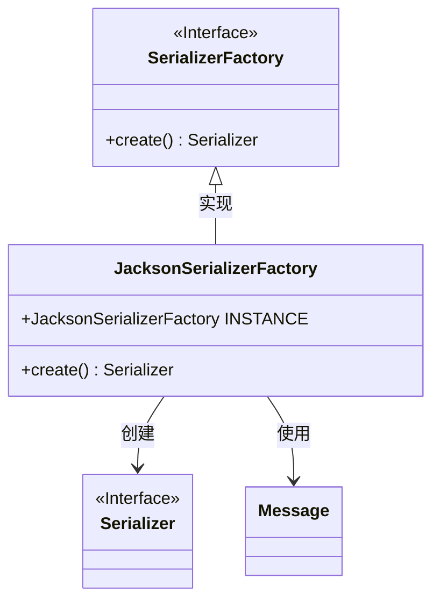
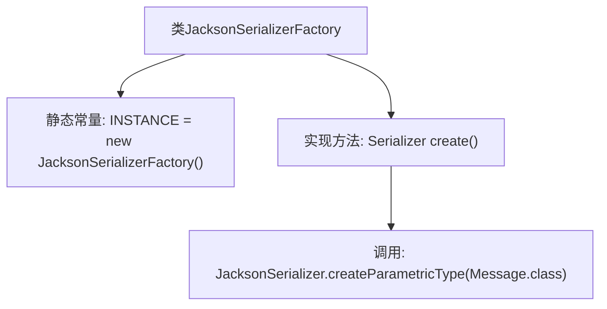

# 基础信息

|      |      |
|------|------|
| 名称 | JacksonSerializerFactory |
| 编码语言 | .java |
| 代码路径 | rabbit-parent/rabbit-common/src/main/java/com/itihub/rabbit/common/serializer/impl/JacksonSerializerFactory.java |
| 包名 | com.itihub.rabbit.common.serializer.impl |
| 依赖项 | ['com.itihub.rabbit.api.Message', 'com.itihub.rabbit.common.serializer.Serializer', 'com.itihub.rabbit.common.serializer.SerializerFactory'] |
| 概述说明 | JacksonSerializerFactory实现SerializerFactory，提供创建Message类序列化器的方法。 |

# 说明

该内容描述了一个名为JacksonSerializerFactory的Java类，实现了SerializerFactory接口。该类包含一个公共静态常量INSTANCE，用于提供单例实例。其核心功能是通过重写create方法，调用JacksonSerializer.createParametricType方法生成Message类的参数化类型序列化器。整个实现简洁，专注于为特定消息类型提供Jackson库的序列化功能。

# 类列表 Class Summary

| 名称   | 类型  | 说明 |
|-------|------|-------------|
| JacksonSerializerFactory | class | JacksonSerializerFactory单例实现，创建Message类的Jackson序列化器。 |

## 类 JacksonSerializerFactory

|      |      |
|------|------|
| 访问范围 | public |
| 类型 | class |
| 名称 | JacksonSerializerFactory |
| 说明 | JacksonSerializerFactory单例实现，创建Message类的Jackson序列化器。 |

### UML类图

这段类图展示了JacksonSerializerFactory作为SerializerFactory接口的实现类，其核心功能是通过create()方法生成Serializer实例。图中明确体现了工厂模式结构：接口定义创建契约，实现类负责具体实例化过程。JacksonSerializerFactory依赖Message类作为序列化参数类型，并通过静态INSTANCE提供单例访问点。整个设计符合开闭原则，便于扩展新的序列化实现。

### 内部方法调用关系图

这段流程图描述了JacksonSerializerFactory类的结构及其核心方法调用关系。该类实现了SerializerFactory接口，包含一个静态常量INSTANCE和重写的create()方法。create()方法内部调用了JacksonSerializer的静态工厂方法createParametricType，并指定Message.class作为参数类型。整个流程展示了从类初始化到生成特定类型序列化器的完整路径，体现了工厂模式的核心设计思想。

### 字段列表 Field List

| 名称  | 类型  | 说明 |
|-------|-------|------|
| INSTANCE = new JacksonSerializerFactory() | JacksonSerializerFactory | 静态单例Jackson序列化工厂实例 |

### 方法列表 Method List

| 名称  | 类型  | 说明 |
|-------|-------|------|
| create | Serializer | 创建返回Message类的Jackson序列化器。 |

