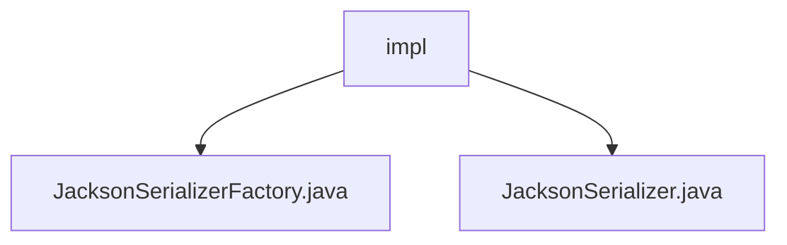

# 基础信息

|      |      |
|------|------|
| 名称 | impl |
| 编码语言 | .java |
| 代码路径 | rabbit-parent/rabbit-common/src/main/java/com/itihub/rabbit/common/serializer/impl |
| 包名 | rabbit-parent.docs.rabbit-common.src.main.java.com.itihub.rabbit.common.serializer.impl |
| 概述说明 | Jackson序列化工具类，含单例工厂和参数化类型处理，支持多种JSON特性与异常处理。 |

# 说明

## 概述

该代码模块是一个基于Jackson库实现的序列化工具集，主要提供JSON格式的消息序列化与反序列化功能。模块包含两个核心类：
1. **JacksonSerializerFactory**：实现了`SerializerFactory`接口，通过单例模式为特定消息类型生成参数化序列化器
2. **JacksonSerializer**：封装Jackson的核心序列化操作，支持灵活的对象与JSON字符串/字节数组之间的双向转换

模块设计特点：
- 采用工厂模式解耦序列化器创建
- 通过静态常量实现单例模式
- 内置ObjectMapper的预配置优化
- 完善的异常处理和日志记录

## 主要业务场景

1. **消息序列化场景**：
   - 将消息对象转换为JSON格式的字节数组或字符串
   - 适用于消息队列传输、网络通信等需要二进制格式的场景

2. **消息反序列化场景**：
   - 从JSON字符串或字节数组还原为Java对象
   - 适用于接收端消息解析、持久化数据读取等场景

3. **特殊JSON处理场景**：
   - 支持非标准JSON格式（含注释、非数值数字、前导零等）
   - 处理未知属性时不报错，提高兼容性
   - 适用于需要处理第三方或异构系统数据的场景

4. **参数化类型序列化**：
   - 通过`createParametricType`方法处理泛型类型的序列化
   - 适用于需要保持类型信息的复杂对象传输场景

### 包内部结构视图

该流程图展示了rabbit-common项目中serializer实现类的层级结构。根节点"impl"表示序列化实现包，包含两个具体实现类：JacksonSerializerFactory（Jackson序列化工厂类）和JacksonSerializer（Jackson序列化器类）。这种结构体现了工厂模式的设计，其中工厂类负责创建具体的序列化器实例。

# 文件列表 File List

| 名称   | 类型  | 说明 |
|-------|------|-------------|
| [JacksonSerializer.java](JacksonSerializer.md) | file | Jackson序列化类，配置灵活，支持多种JSON特性，提供序列化和反序列化方法。 |
| [JacksonSerializerFactory.java](JacksonSerializerFactory.md) | file | JacksonSerializerFactory实现SerializerFactory，提供创建Message类序列化器的方法。 |

