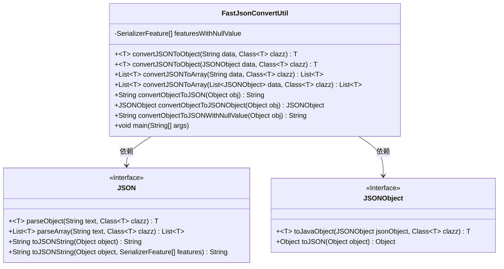
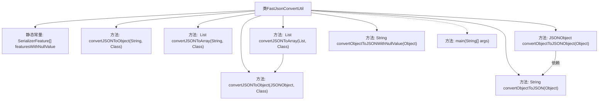

# 基础信息

|      |      |
|------|------|
| 名称 | FastJsonConvertUtil |
| 编码语言 | .java |
| 代码路径 | rabbit-parent/rabbit-common/src/main/java/com/itihub/rabbit/common/util/FastJsonConvertUtil.java |
| 包名 | com.itihub.rabbit.common.util |
| 依赖项 | ['com.alibaba.fastjson.JSON', 'com.alibaba.fastjson.JSONObject', 'com.alibaba.fastjson.serializer.SerializerFeature', 'java.util.ArrayList', 'java.util.List'] |
| 概述说明 | FastJson工具类，提供JSON与对象互转功能，支持空值处理。 |

# 说明

FastJsonConvertUtil是一个提供JSON与Java对象相互转换的工具类。它包含将JSON字符串或JSONObject转换为指定类型对象的方法，支持单个对象和列表转换。同时提供将Java对象转为JSON字符串或JSONObject的功能，包括处理空值的序列化选项。所有方法均包含异常处理，出错时返回null并打印异常。工具类还包含一个测试主方法用于输出系统属性。

# 类列表 Class Summary

| 名称   | 类型  | 说明 |
|-------|------|-------------|
| FastJsonConvertUtil | class | FastJson工具类，实现JSON与对象互转，支持空值处理。 |

## 类 FastJsonConvertUtil

|      |      |
|------|------|
| 访问范围 | public |
| 类型 | class |
| 名称 | FastJsonConvertUtil |
| 说明 | FastJson工具类，实现JSON与对象互转，支持空值处理。 |

### UML类图

这段代码展示了一个FastJsonConvertUtil工具类，主要用于实现JSON与Java对象之间的相互转换。该类提供了多种静态方法，包括将JSON字符串或JSONObject转换为Java对象、将Java对象转换为JSON字符串或JSONObject，以及处理空值的特殊序列化功能。类图中清晰地显示了FastJsonConvertUtil与JSON、JSONObject接口之间的依赖关系，以及各类方法的访问权限和泛型参数。工具类通过捕获异常并返回null来处理错误情况，同时使用SerializerFeature数组来控制JSON序列化的细节行为。

### 内部方法调用关系图

该流程图展示了FastJsonConvertUtil工具类的核心结构，包含7个主要JSON转换方法和1个测试主方法。类通过静态常量featuresWithNullValue定义空值序列化策略，提供字符串/JSONObject与Java对象相互转换的双向能力，支持单个对象和集合的转换处理。其中convertJSONToArray方法会内部调用convertJSONToObject实现批量转换，convertObjectToJSONObject与基础转换方法存在依赖关系，整体构成一个完整的JSON处理工具链。

### 字段列表 Field List

| 名称  | 类型  | 说明 |
|-------|-------|------|
| featuresWithNullValue = {			SerializerFeature.WriteMapNullValue			, SerializerFeature.WriteNullBooleanAsFalse, SerializerFeature.WriteNullListAsEmpty			, SerializerFeature.WriteNullNumberAsZero, SerializerFeature.WriteNullStringAsEmpty	} | SerializerFeature[] | 序列化空值处理配置，包括布尔、列表、数字和字符串的默认值设置。 |

### 方法列表 Method List

| 名称  | 类型  | 说明 |
|-------|-------|------|
| main | void | Java主方法打印系统属性。 |
| convertObjectToJSONObject | JSONObject | 将对象转为JSONObject，异常返回null。 |
| convertObjectToJSON | String | 将对象转为JSON字符串，异常返回null。 |
| convertJSONToArray | List<T> | 将JSON对象列表转换为指定类型的对象列表，异常时返回空。 |
| convertObjectToJSONWithNullValue | String | 将对象转为含空值的JSON字符串，异常返回null。 |
| convertJSONToObject | T | 将JSON字符串转换为指定类对象，异常返回null。 |
| convertJSONToArray | List<T> | 将JSON字符串转换为指定类型的列表，异常时返回null。 |
| convertJSONToObject | T | 将JSON对象转换为指定类的实例，失败返回null。 |

