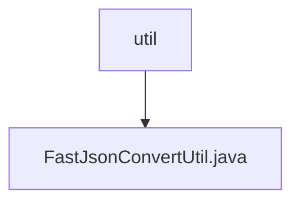

# 基础信息

|      |      |
|------|------|
| 名称 | util |
| 编码语言 | .java |
| 代码路径 | rabbit-parent/rabbit-common/src/main/java/com/itihub/rabbit/common/util |
| 包名 | rabbit-parent.docs.rabbit-common.src.main.java.com.itihub.rabbit.common.util |
| 概述说明 | FastJson工具类，提供JSON与对象互转功能，支持空值处理。 |

# 说明

FastJsonConvertUtil是一个提供JSON与Java对象相互转换的工具类。它包含将JSON字符串或JSONObject转换为指定类型对象的方法，支持单个对象和列表转换。同时提供将Java对象转为JSON字符串或JSONObject的功能，包括处理空值的序列化选项。所有方法均包含异常处理，出错时返回null并打印异常。工具类还包含一个测试主方法用于输出系统属性。

### 包内部结构视图

该流程图展示了rabbit-common项目中util包与FastJsonConvertUtil.java文件的层级关系。顶层节点为util目录，其下级仅包含一个Java工具类文件FastJsonConvertUtil.java，表明这是该工具包中的唯一展示组件。结构简洁明了，体现了工具类文件的独立存放特征。

# 文件列表 File List

| 名称   | 类型  | 说明 |
|-------|------|-------------|
| [FastJsonConvertUtil.java](FastJsonConvertUtil.md) | file | FastJson工具类，提供JSON与对象互转功能，支持空值处理。 |

