# 基础信息

|      |      |
|------|------|
| 名称 | com |
| 编码语言 | .java |
| 代码路径 | rabbit-parent/rabbit-core-producer/src/main/java/com |
| 包名 | rabbit-parent.docs.rabbit-core-producer.src.main.java.com |
| 概述说明 | RabbitMQ生产者模块，含消息存储、状态管理、异步发送、重试机制及数据库配置，确保可靠投递。 |

# 说明

# RabbitMQ生产者核心模块总结

## 概述
该代码模块是一个完整的RabbitMQ消息生产者实现，提供从消息存储、状态管理到可靠性投递的全套解决方案。模块采用分层架构设计，包含数据访问层、服务层、业务逻辑层和自动配置层，核心功能包括：
- 消息的持久化存储与状态管理
- 多种消息发送策略（快速/确认/可靠发送）
- 异步消息处理与批量操作
- 失败消息的自动重试补偿机制
- 动态连接管理与资源隔离

## 主要业务场景

### 1. 可靠性消息投递
- **消息落库+重试机制**：通过`RetryMessageDataflowJob`定时任务处理超时消息（状态为SENDING），最多重试3次
- **状态管理**：使用`BrokerMessageStatus`枚举（SENDING/SEND_OK/SEND_FAIL等）标准化消息生命周期
- **补偿流程**：`MessageStoreService`配合`BrokerMessageMapper`完成状态更新和重试计数

### 2. 异步消息处理
- **线程池隔离**：通过`AsyncBaseQueue`、`CallbackAsyncQueue`等专用线程池处理不同类型任务
- **批量操作**：`MessageHolder`利用ThreadLocal实现线程安全的批量消息暂存
- **动态模板管理**：`RabbitTemplateContainer`根据topic动态创建/复用RabbitTemplate实例

### 3. 消息存储与访问
- **数据持久化**：`BrokerMessage`实体记录消息ID、内容、状态、重试次数等核心字段
- **CRUD操作**：`BrokerMessageMapper`提供完整的消息增删改查接口
- **扩展查询**：支持按状态筛选、超时消息查询等业务场景

### 4. 自动配置集成
- **组件装配**：`RabbitProducerAutoConfiguration`自动构建消息存储服务、代理实现等核心Bean
- **MyBatis集成**：通过专用配置类管理数据源、SQL会话工厂和Mapper扫描
- **表结构初始化**：自动执行SQL脚本创建消息存储表

### 5. 生产环境关键保障
- **超时控制**：`BrokerMessageConst`定义默认1分钟超时阈值
- **ACK确认**：通过`RabbitTemplateContainer.confirm`处理Broker响应
- **资源隔离**：线程池参数可配置（线程数、队列容量等），避免资源竞争

### 包内部结构视图

```mermaid
graph TD
    rabbit --> producer
    producer --> task
    producer --> entity
    producer --> service
    producer --> constant
    producer --> mapping
    producer --> config
    producer --> broker
    producer --> autoconfigure
    producer --> mapper
    task --> RetryMessageDataflowJob.java
    entity --> BrokerMessage.java
    service --> MessageStoreService.java
    constant --> BrokerMessageStatus.java
    constant --> BrokerMessageConst.java
    config --> database
    database --> RabbitProduceMyBatisConfiguration.java
    database --> RabbitProducerMybatisMapperScannerConfig.java
    database --> RabbitProducerDataSourceConfiguration.java
    database --> BrokerMessageTableConfiguration.java
    broker --> AsyncBaseQueue.java
    broker --> MessageHolder.java
    broker --> CallbackAsyncQueue.java
    broker --> RabbitBrokerImpl.java
    broker --> MessageHolderAsyncQueue.java
    broker --> RabbitTemplateContainer.java
    broker --> RabbitBroker.java
    broker --> ProducerClient.java
    autoconfigure --> RabbitProducerAutoConfiguration.java
    mapper --> BrokerMessageMapper.java
```

该流程图展示了RabbitMQ生产者模块的完整代码结构，从顶层rabbit节点开始，逐级展开到producer核心模块及其子模块。包含任务调度、实体类、服务层、常量定义、配置中心、消息代理等核心组件，其中config/database子模块详细展示了MyBatis相关配置类，broker模块则完整呈现了消息队列实现相关的关键类文件。整个结构清晰体现了生产者模块的功能划分和层级关系。

# 文件列表 File List

| 名称   | 类型  | 说明 |
|-------|------|-------------|
| [itihub](itihub/_module.md) | package | RabbitMQ生产者模块，含消息存储、状态管理、异步发送、重试机制及数据库配置，确保可靠投递。 |

