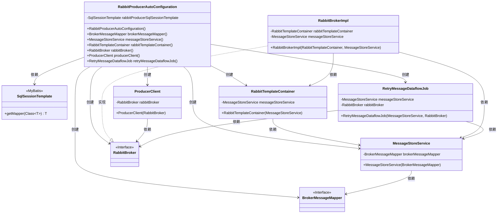
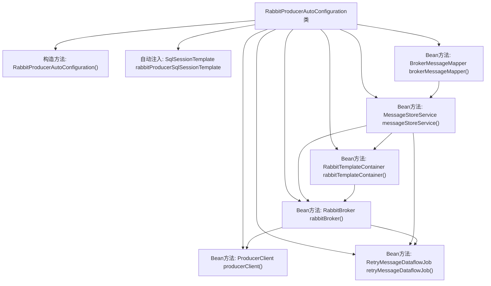

# 基础信息

|      |      |
|------|------|
| 名称 | RabbitProducerAutoConfiguration |
| 编码语言 | .java |
| 代码路径 | rabbit-parent/rabbit-core-producer/src/main/java/com/itihub/rabbit/producer/autoconfigure/RabbitProducerAutoConfiguration.java |
| 包名 | com.itihub.rabbit.producer.autoconfigure |
| 依赖项 | ['com.itihub.rabbit.producer.broker.ProducerClient', 'com.itihub.rabbit.producer.broker.RabbitBroker', 'com.itihub.rabbit.producer.broker.RabbitBrokerImpl', 'com.itihub.rabbit.producer.broker.RabbitTemplateContainer', 'com.itihub.rabbit.producer.config.database.RabbitProduceMyBatisConfiguration', 'com.itihub.rabbit.producer.mapper.BrokerMessageMapper', 'com.itihub.rabbit.producer.service.MessageStoreService', 'com.itihub.rabbit.producer.task.RetryMessageDataflowJob', 'lombok.extern.slf4j.Slf4j', 'org.mybatis.spring.SqlSessionTemplate', 'org.springframework.beans.factory.annotation.Autowired', 'org.springframework.boot.autoconfigure.AutoConfigureAfter', 'org.springframework.context.annotation.Bean', 'org.springframework.context.annotation.Configuration'] |
| 概述说明 | RabbitMQ生产者自动配置类，初始化相关Bean和服务。 |

# 说明

这是一个名为RabbitProducerAutoConfiguration的Spring配置类，用于自动配置RabbitMQ生产者相关组件。该类在RabbitProduceMyBatisConfiguration之后自动配置，初始化时会记录日志。它通过注入SqlSessionTemplate来创建BrokerMessageMapper，并依次构建MessageStoreService、RabbitTemplateContainer、RabbitBrokerImpl、ProducerClient和RetryMessageDataflowJob等Bean。这些组件共同构成了RabbitMQ消息生产者的核心功能，包括消息存储、消息发送和重试机制等。

# 类列表 Class Summary

| 名称   | 类型  | 说明 |
|-------|------|-------------|
| RabbitProducerAutoConfiguration | class | RabbitMQ生产者自动配置类，初始化消息存储、容器和客户端组件。 |

## 类 RabbitProducerAutoConfiguration

|      |      |
|------|------|
| 访问范围 | @Slf4j;@Configuration;@AutoConfigureAfter(value = {RabbitProduceMyBatisConfiguration.class});public |
| 类型 | class |
| 名称 | RabbitProducerAutoConfiguration |
| 说明 | RabbitMQ生产者自动配置类，初始化消息存储、容器和客户端组件。 |

### UML类图

这段代码是一个Spring Boot自动配置类，主要功能是初始化RabbitMQ消息生产相关的组件。通过SqlSessionTemplate创建BrokerMessageMapper，然后依次构建MessageStoreService、RabbitTemplateContainer、RabbitBrokerImpl等核心组件，最终暴露ProducerClient和RetryMessageDataflowJob两个功能Bean。整个配置展现了从数据访问层到业务层的完整依赖链，各组件通过构造函数注入方式实现松耦合。

### 内部方法调用关系图

这段代码展示了一个Spring Boot配置类RabbitProducerAutoConfiguration，用于自动配置RabbitMQ相关组件。流程图清晰地呈现了类中各个Bean方法的依赖关系：从基础的BrokerMessageMapper开始，逐步构建MessageStoreService、RabbitTemplateContainer等中间组件，最终生成ProducerClient和RetryMessageDataflowJob两个终端Bean。所有Bean都通过方法调用链相互关联，其中messageStoreService()和rabbitBroker()被多个方法复用，体现了Spring依赖注入的核心机制。

### 字段列表 Field List

| 名称  | 类型  | 说明 |
|-------|-------|------|
| rabbitProducerSqlSessionTemplate | SqlSessionTemplate | 自动注入RabbitMQ生产者SQL会话模板 |

### 方法列表 Method List

| 名称  | 类型  | 说明 |
|-------|-------|------|
| producerClient | ProducerClient | 创建ProducerClient实例，依赖rabbitBroker。 |
| messageStoreService | MessageStoreService | 创建MessageStoreService实例，依赖brokerMessageMapper。 |
| rabbitTemplateContainer | RabbitTemplateContainer | 创建RabbitTemplateContainer实例，依赖messageStoreService。 |
| brokerMessageMapper | BrokerMessageMapper | 创建BrokerMessageMapper实例，通过rabbitProducerSqlSessionTemplate获取映射器。 |
| rabbitBroker | RabbitBroker | 创建RabbitBroker实例，依赖RabbitTemplateContainer和MessageStoreService。 |
| retryMessageDataflowJob | RetryMessageDataflowJob | 定义RetryMessageDataflowJob Bean，依赖messageStoreService和rabbitBroker。 |

