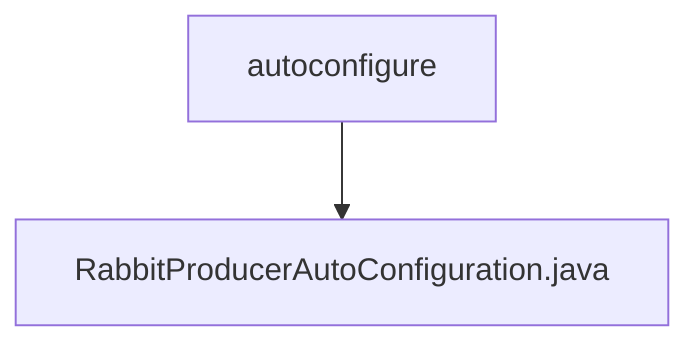

# 基础信息

|      |      |
|------|------|
| 名称 | autoconfigure |
| 编码语言 | .java |
| 代码路径 | rabbit-parent/rabbit-core-producer/src/main/java/com/itihub/rabbit/producer/autoconfigure |
| 包名 | rabbit-parent.docs.rabbit-core-producer.src.main.java.com.itihub.rabbit.producer.autoconfigure |
| 概述说明 | RabbitMQ生产者自动配置类，初始化相关Bean和服务。 |

# 说明

这是一个名为RabbitProducerAutoConfiguration的Spring配置类，用于自动配置RabbitMQ生产者相关组件。该类在RabbitProduceMyBatisConfiguration之后自动配置，初始化时会记录日志。它通过注入SqlSessionTemplate来创建BrokerMessageMapper，并依次构建MessageStoreService、RabbitTemplateContainer、RabbitBrokerImpl、ProducerClient和RetryMessageDataflowJob等Bean。这些组件共同构成了RabbitMQ消息生产者的核心功能，包括消息存储、消息发送和重试机制等。

### 包内部结构视图

该流程图展示了rabbit-core-producer模块中自动配置类的层级关系。顶层节点是autoconfigure目录，其下包含一个自动配置类RabbitProducerAutoConfiguration.java。这个结构反映了Spring Boot自动配置的标准模式，其中核心配置类位于autoconfigure目录下，用于实现消息生产者的自动配置功能。

# 文件列表 File List

| 名称   | 类型  | 说明 |
|-------|------|-------------|
| [RabbitProducerAutoConfiguration.java](RabbitProducerAutoConfiguration.md) | file | RabbitMQ生产者自动配置类，初始化相关Bean和服务。 |

