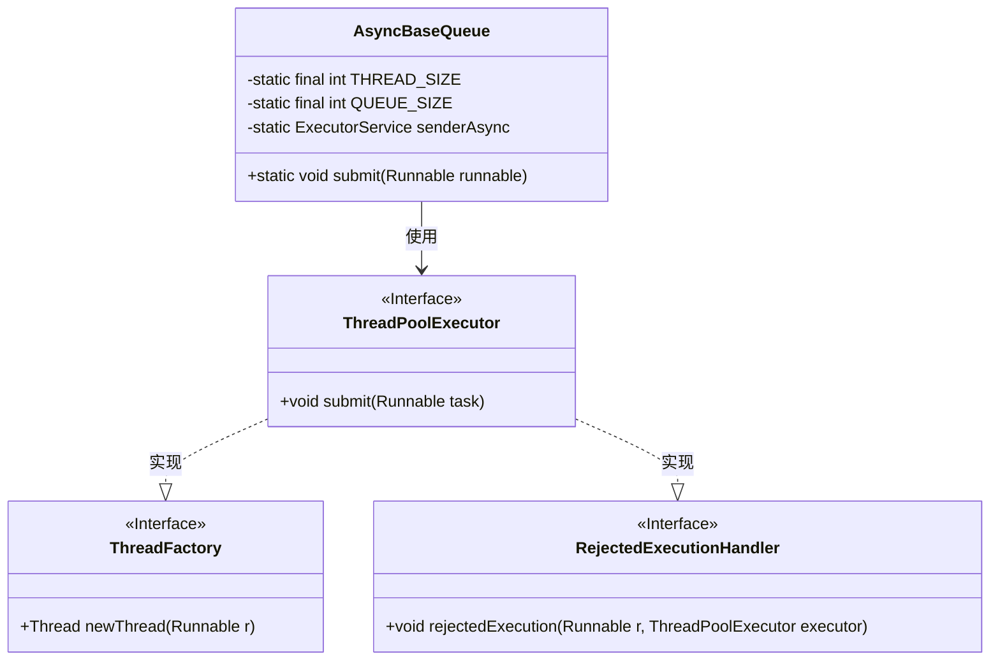
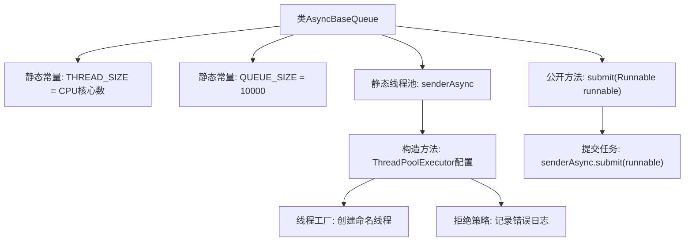

# 基础信息

|      |      |
|------|------|
| 名称 | AsyncBaseQueue |
| 编码语言 | .java |
| 代码路径 | rabbit-parent/rabbit-core-producer/src/main/java/com/itihub/rabbit/producer/broker/AsyncBaseQueue.java |
| 包名 | com.itihub.rabbit.producer.broker |
| 依赖项 | ['lombok.extern.slf4j.Slf4j', 'java.util.concurrent'] |
| 概述说明 | 异步消息队列线程池，核心线程数等于CPU数，队列容量10000，拒绝策略记录错误日志。 |

# 说明

AsyncBaseQueue类是一个用于异步消息处理的线程池工具类。它使用ThreadPoolExecutor创建固定大小的线程池，线程数量等于CPU核心数。队列采用ArrayBlockingQueue，容量为10000。线程命名为rabbitmq_client_async_sender，空闲线程60秒后回收。当任务被拒绝时记录错误日志。提供submit方法提交Runnable任务。

# 类列表 Class Summary

| 名称   | 类型  | 说明 |
|-------|------|-------------|
| AsyncBaseQueue | class | 异步消息处理线程池，固定线程数，队列容量10000，拒绝时记录错误。 |

## 类 AsyncBaseQueue

|      |      |
|------|------|
| 访问范围 | @Slf4j;public |
| 类型 | class |
| 名称 | AsyncBaseQueue |
| 说明 | 异步消息处理线程池，固定线程数，队列容量10000，拒绝时记录错误。 |

### UML类图

这段代码定义了一个异步队列处理类AsyncBaseQueue，它使用ThreadPoolExecutor创建了一个固定大小的线程池来处理异步任务。线程池配置了自定义的线程工厂和拒绝策略，当任务被拒绝时会记录错误日志。类图展示了AsyncBaseQueue与ThreadPoolExecutor、ThreadFactory和RejectedExecutionHandler之间的关系，其中后两者是接口，ThreadPoolExecutor实现了这两个接口的功能。该类主要用于提交Runnable任务到线程池异步执行，适合高并发场景下的任务处理。

### 内部方法调用关系图

该流程图展示了AsyncBaseQueue类的核心结构，主要包含线程池的初始化配置和任务提交流程。通过ThreadPoolExecutor构建固定大小的线程池，自定义线程命名工厂和拒绝策略。当调用submit方法时，任务会被提交到线程池执行，若线程池满则触发拒绝策略记录错误日志。整个设计实现了异步任务的高效处理与容错机制。

### 字段列表 Field List

| 名称  | 类型  | 说明 |
|-------|-------|------|
| THREAD_SIZE = Runtime.getRuntime().availableProcessors() | int | 定义线程数为CPU核心数。 |
| QUEUE_SIZE = 10000 | int | 私有常量队列大小设为10000 |
| senderAsync = new ThreadPoolExecutor(            THREAD_SIZE,            THREAD_SIZE,            60L,            TimeUnit.SECONDS,            new ArrayBlockingQueue<>(QUEUE_SIZE),            new ThreadFactory() {                @Override                public Thread newThread(Runnable r) {                    Thread t = new Thread(r);                    t.setName("rabbitmq_client_async_sender");                    return t;                }            },            new RejectedExecutionHandler() {                @Override                public void rejectedExecution(Runnable r, ThreadPoolExecutor executor) {                    log.error("async sender is error rejected, runnable: {}, executor: {}", r, executor);                }            }) | ExecutorService | 创建线程池处理异步发送任务，固定线程数，队列满时记录错误。 |

### 方法列表 Method List

| 名称  | 类型  | 说明 |
|-------|-------|------|
| submit | void | 异步提交Runnable任务到senderAsync执行。 |

