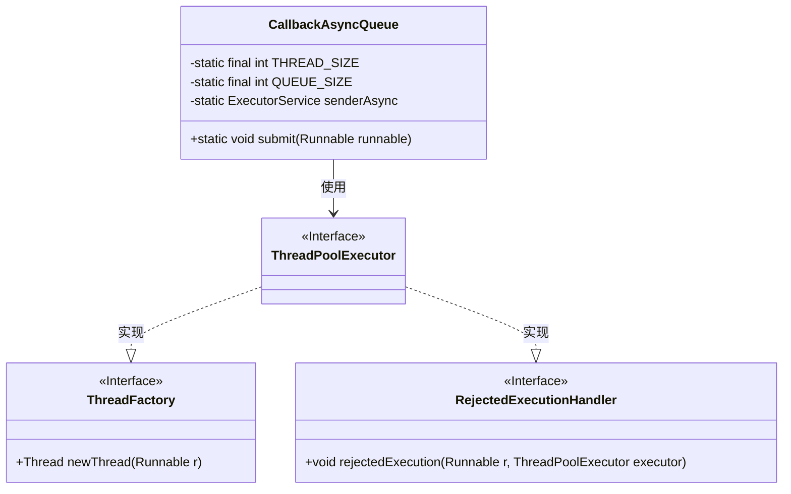
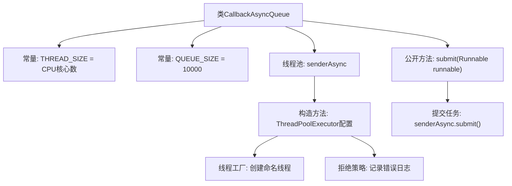

# 基础信息

|      |      |
|------|------|
| 名称 | CallbackAsyncQueue |
| 编码语言 | .java |
| 代码路径 | rabbit-parent/rabbit-core-producer/src/main/java/com/itihub/rabbit/producer/broker/CallbackAsyncQueue.java |
| 包名 | com.itihub.rabbit.producer.broker |
| 依赖项 | ['lombok.extern.slf4j.Slf4j', 'java.util.concurrent'] |
| 概述说明 | 异步线程池处理消息，线程数等于CPU核数，队列大小10000，拒绝时记录错误。 |

# 说明

这是一个名为CallbackAsyncQueue的Java类，用于异步消息处理。它创建了一个固定大小的线程池，线程数量等于CPU核心数，队列容量为10000。线程池使用ArrayBlockingQueue作为工作队列，线程命名为rabbitmq_client_async_sender。当任务被拒绝时，会记录错误日志。提供了submit方法用于提交任务。线程空闲60秒后会被回收。

# 类列表 Class Summary

| 名称   | 类型  | 说明 |
|-------|------|-------------|
| CallbackAsyncQueue | class | 异步线程池处理消息，线程数等于CPU核数，队列大小1万，拒绝时记录错误日志。 |

## 类 CallbackAsyncQueue

|      |      |
|------|------|
| 访问范围 | @Slf4j;public |
| 类型 | class |
| 名称 | CallbackAsyncQueue |
| 说明 | 异步线程池处理消息，线程数等于CPU核数，队列大小1万，拒绝时记录错误日志。 |

### UML类图

这段代码展示了一个异步回调队列的实现，使用线程池处理任务。CallbackAsyncQueue类包含静态线程池配置，通过ThreadPoolExecutor实现任务提交，并自定义了线程工厂和拒绝策略。当队列满时，拒绝处理器会记录错误日志。该设计适用于高并发场景下的异步任务处理，能有效控制资源使用并处理任务溢出情况。

### 内部方法调用关系图

该流程图展示了CallbackAsyncQueue类的核心结构，重点描述了线程池的初始化配置和任务提交流程。类中包含两个关键常量(线程数量和队列容量)，通过ThreadPoolExecutor构建具有自定义线程命名和拒绝策略的线程池。公开的submit方法将Runnable任务提交到线程池执行，当任务被拒绝时会记录详细错误日志。整个设计实现了异步任务处理的队列机制，适用于高并发场景下的任务调度。

### 字段列表 Field List

| 名称  | 类型  | 说明 |
|-------|-------|------|
| THREAD_SIZE = Runtime.getRuntime().availableProcessors() | int | 定义线程池大小为当前CPU核心数 |
| QUEUE_SIZE = 10000 | int | 定义常量QUEUE_SIZE，值为10000。 |
| senderAsync = new ThreadPoolExecutor(            THREAD_SIZE,            THREAD_SIZE,            60L,            TimeUnit.SECONDS,            new ArrayBlockingQueue<>(QUEUE_SIZE),            new ThreadFactory() {                @Override                public Thread newThread(Runnable r) {                    Thread t = new Thread(r);                    t.setName("rabbitmq_client_async_sender");                    return t;                }            },            new RejectedExecutionHandler() {                @Override                public void rejectedExecution(Runnable r, ThreadPoolExecutor executor) {                    log.error("async sender is error rejected, runnable: {}, executor: {}", r, executor);                }            }) | ExecutorService | 创建线程池处理异步发送任务，自定义线程名和拒绝策略。 |

### 方法列表 Method List

| 名称  | 类型  | 说明 |
|-------|-------|------|
| submit | void | 异步提交Runnable任务。 |

