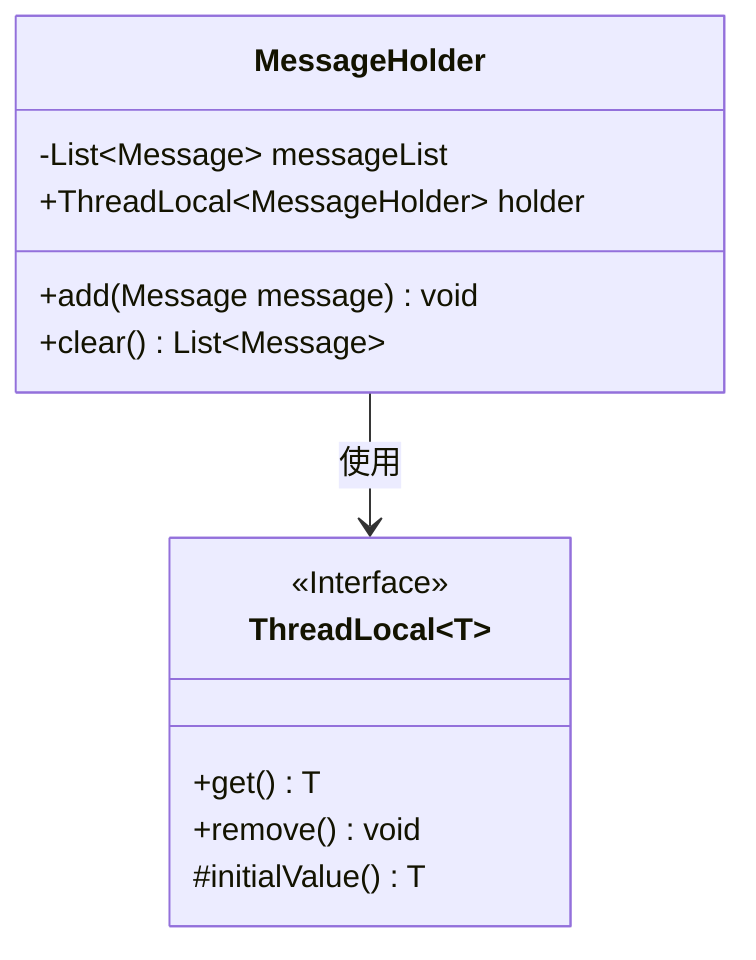
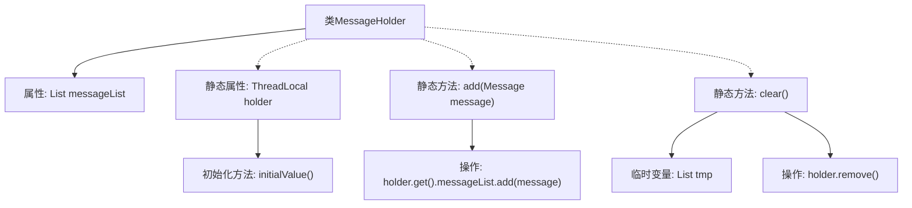

# 基础信息

|      |      |
|------|------|
| 名称 | MessageHolder |
| 编码语言 | .java |
| 代码路径 | rabbit-parent/rabbit-core-producer/src/main/java/com/itihub/rabbit/producer/broker/MessageHolder.java |
| 包名 | com.itihub.rabbit.producer.broker |
| 依赖项 | ['com.google.common.collect.Lists', 'com.itihub.rabbit.api.Message', 'java.util.List'] |
| 概述说明 | 线程安全的MessageHolder类，存储消息列表，支持添加和清空操作。 |

# 说明

该代码定义了一个名为MessageHolder的类，用于管理消息列表。它包含一个线程本地变量holder，确保每个线程拥有独立的MessageHolder实例。类提供了两个静态方法：add方法用于向当前线程的消息列表添加消息，clear方法则清空当前线程的消息列表并返回原有内容。通过ThreadLocal机制实现了线程安全的消息管理。

# 类列表 Class Summary

| 名称   | 类型  | 说明 |
|-------|------|-------------|
| MessageHolder | class | 线程安全的MessageHolder类，存储消息列表，支持添加和清除操作。 |

## 类 MessageHolder

|      |      |
|------|------|
| 访问范围 | public |
| 类型 | class |
| 名称 | MessageHolder |
| 说明 | 线程安全的MessageHolder类，存储消息列表，支持添加和清除操作。 |

### UML类图

类图描述：MessageHolder类通过ThreadLocal实现线程隔离的消息存储，包含私有消息列表messageList和静态ThreadLocal变量holder。提供add()方法添加消息到当前线程的列表，clear()方法移除并返回当前线程的所有消息。ThreadLocal作为泛型接口，提供线程局部变量的获取、移除和初始值设置功能。

### 内部方法调用关系图

这段代码展示了一个线程安全的MessageHolder类，使用ThreadLocal来确保每个线程拥有独立的MessageHolder实例。流程图清晰地描述了类的结构：包含一个消息列表属性、ThreadLocal静态变量及其初始化方法，以及添加消息和清空消息的两个核心静态方法。通过holder.get()获取当前线程的实例，add()方法将消息添加到线程本地的列表中，clear()方法则移除ThreadLocal引用并返回暂存的消息列表。

### 字段列表 Field List

| 名称  | 类型  | 说明 |
|-------|-------|------|
| messageList = Lists.newArrayList() | List<Message> | 声明一个私有的消息列表变量messageList。 |
| holder = new ThreadLocal<MessageHolder>(){        @Override        protected MessageHolder initialValue() {            return new MessageHolder();        }    } | ThreadLocal<MessageHolder> | 线程局部变量holder，初始值为MessageHolder实例。 |

### 方法列表 Method List

| 名称  | 类型  | 说明 |
|-------|-------|------|
| clear | List<Message> | 静态方法clear清空消息列表并返回原列表。 |
| add | void | 静态方法add将消息对象添加到holder的消息列表中。 |

