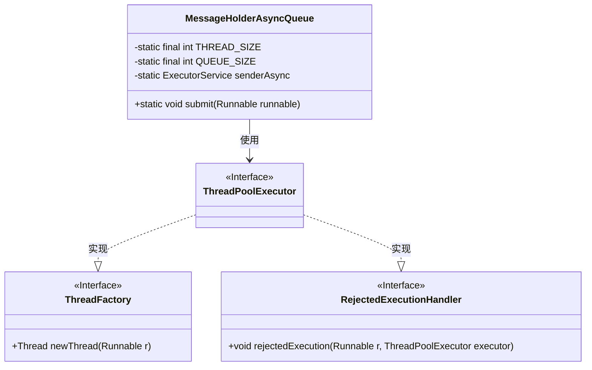
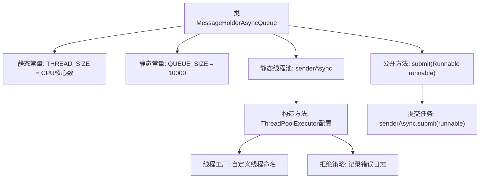

# 基础信息

|      |      |
|------|------|
| 名称 | MessageHolderAsyncQueue |
| 编码语言 | .java |
| 代码路径 | rabbit-parent/rabbit-core-producer/src/main/java/com/itihub/rabbit/producer/broker/MessageHolderAsyncQueue.java |
| 包名 | com.itihub.rabbit.producer.broker |
| 依赖项 | ['lombok.extern.slf4j.Slf4j', 'java.util.concurrent'] |
| 概述说明 | 异步消息线程池，核心线程数等于CPU数，队列容量1万，线程名自定义，拒绝策略记录错误日志。 |

# 说明

这是一个名为MessageHolderAsyncQueue的Java类，用于异步消息处理。它创建了一个固定大小的线程池，线程数量等于CPU核心数，队列容量为10000。线程池使用自定义线程工厂，将线程命名为rabbitmq_client_message_holder_async_sender，并设置了60秒的线程空闲存活时间。当任务被拒绝时，会记录错误日志。类提供了submit方法用于提交任务到线程池。

# 类列表 Class Summary

| 名称   | 类型  | 说明 |
|-------|------|-------------|
| MessageHolderAsyncQueue | class | 异步消息处理线程池，核心线程数等于CPU数，队列大小10000，线程名和拒绝策略自定义。 |

## 类 MessageHolderAsyncQueue

|      |      |
|------|------|
| 访问范围 | @Slf4j;public |
| 类型 | class |
| 名称 | MessageHolderAsyncQueue |
| 说明 | 异步消息处理线程池，核心线程数等于CPU数，队列大小10000，线程名和拒绝策略自定义。 |

### UML类图

这段代码定义了一个异步消息队列处理器`MessageHolderAsyncQueue`，它使用线程池来处理异步任务。类中包含静态线程池配置参数，通过`ThreadPoolExecutor`创建固定大小的线程池，并自定义了线程工厂和拒绝策略。当提交任务时，调用`submit`方法将任务加入队列。线程池使用处理器核心数作为线程数，队列容量为10000，线程命名规范且拒绝时会记录错误日志。

### 内部方法调用关系图

该流程图展示了MessageHolderAsyncQueue类的核心结构，重点描述了线程池的初始化配置和任务提交流程。类包含两个静态常量(线程数量和队列容量)，通过ThreadPoolExecutor构建异步处理线程池，自定义了线程命名规则和拒绝策略(记录错误日志)。公开的submit方法将任务提交至线程池执行，适用于高并发消息处理场景，能有效控制资源使用并处理任务拒绝情况。

### 字段列表 Field List

| 名称  | 类型  | 说明 |
|-------|-------|------|
| QUEUE_SIZE = 10000 | int | 私有静态常量队列大小10000 |
| senderAsync = new ThreadPoolExecutor(            THREAD_SIZE,            THREAD_SIZE,            60L,            TimeUnit.SECONDS,            new ArrayBlockingQueue<>(QUEUE_SIZE),            new ThreadFactory() {                @Override                public Thread newThread(Runnable r) {                    Thread t = new Thread(r);                    t.setName("rabbitmq_client_message_holder_async_sender");                    return t;                }            },            new RejectedExecutionHandler() {                @Override                public void rejectedExecution(Runnable r, ThreadPoolExecutor executor) {                    log.error("async sender is error rejected, runnable: {}, executor: {}", r, executor);                }            }) | ExecutorService | 创建线程池处理异步发送，固定线程数，60秒空闲终止，队列满时记录错误。 |
| THREAD_SIZE = Runtime.getRuntime().availableProcessors() | int | 定义线程池大小为当前CPU核心数。 |

### 方法列表 Method List

| 名称  | 类型  | 说明 |
|-------|-------|------|
| submit | void | 静态方法submit接收Runnable参数并异步提交执行。 |

