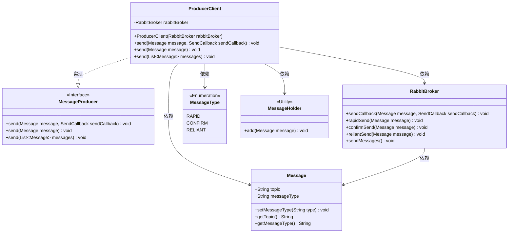
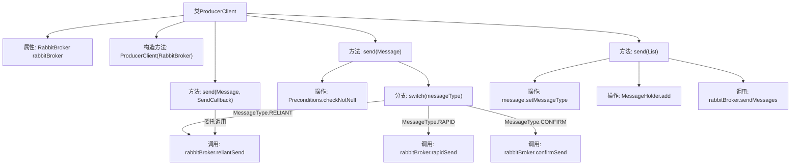

# 基础信息

|      |      |
|------|------|
| 名称 | ProducerClient |
| 编码语言 | .java |
| 代码路径 | rabbit-parent/rabbit-core-producer/src/main/java/com/itihub/rabbit/producer/broker/ProducerClient.java |
| 包名 | com.itihub.rabbit.producer.broker |
| 依赖项 | ['com.google.common.base.Preconditions', 'com.itihub.rabbit.api.Message', 'com.itihub.rabbit.api.MessageProducer', 'com.itihub.rabbit.api.MessageType', 'com.itihub.rabbit.api.SendCallback', 'com.itihub.rabbit.exception.MessageRunTimeException', 'java.util.List'] |
| 概述说明 | ProducerClient通过RabbitBroker发送消息，支持单条和批量发送，按消息类型选择不同发送方式。 |

# 说明

ProducerClient类实现了MessageProducer接口，用于通过RabbitBroker发送消息。构造函数接收RabbitBroker实例。提供三种发送方式：带回调的异步发送send(Message, SendCallback)；单条消息同步发送send(Message)，根据消息类型（RAPID快速、CONFIRM确认、RELIANT可靠）调用不同发送方法，要求消息主题非空；批量发送send(List<Message>)，自动设为RAPID类型并存入MessageHolder后统一发送。异常处理由MessageRunTimeException实现。

# 类列表 Class Summary

| 名称   | 类型  | 说明 |
|-------|------|-------------|
| ProducerClient | class | ProducerClient通过RabbitBroker发送消息，支持单条和批量发送，按可靠性级别处理。 |

## 类 ProducerClient

|      |      |
|------|------|
| 访问范围 | public |
| 类型 | class |
| 名称 | ProducerClient |
| 说明 | ProducerClient通过RabbitBroker发送消息，支持单条和批量发送，按可靠性级别处理。 |

### UML类图

这段代码展示了一个消息生产者客户端(ProducerClient)的实现，它通过RabbitBroker与消息队列交互。ProducerClient实现了MessageProducer接口，提供三种消息发送方式：带回调的异步发送、同步发送（支持RAPID/CONFIRM/RELIANT三种消息类型）和批量发送。核心类包括消息实体(Message)、消息类型枚举(MessageType)、消息暂存器(MessageHolder)和消息代理(RabbitBroker)。该设计实现了消息生产与传输的解耦，支持多种可靠性级别的消息投递方式。

### 内部方法调用关系图

这段代码流程图展示了ProducerClient类的核心结构和消息发送流程。该类通过RabbitBroker实现三种消息发送模式（迅速/确认/可靠），支持单消息和批量发送。主要流程包括：构造方法初始化消息代理，send方法根据消息类型选择不同发送策略，批量发送时统一设置为迅速消息并委托RabbitBroker执行。关键操作包括消息非空校验、类型判断和消息队列操作，体现了消息中间件客户端的典型设计模式。

### 字段列表 Field List

| 名称  | 类型  | 说明 |
|-------|-------|------|
| rabbitBroker | RabbitBroker | 私有RabbitMQ代理实例 |

### 方法列表 Method List

| 名称  | 类型  | 说明 |
|-------|-------|------|
| send | void | 重写send方法，调用rabbitBroker发送消息并处理回调。 |
| send | void | 根据消息类型调用不同发送方法。 |
| send | void | 重写send方法，设置消息类型为RAPID并发送。 |

