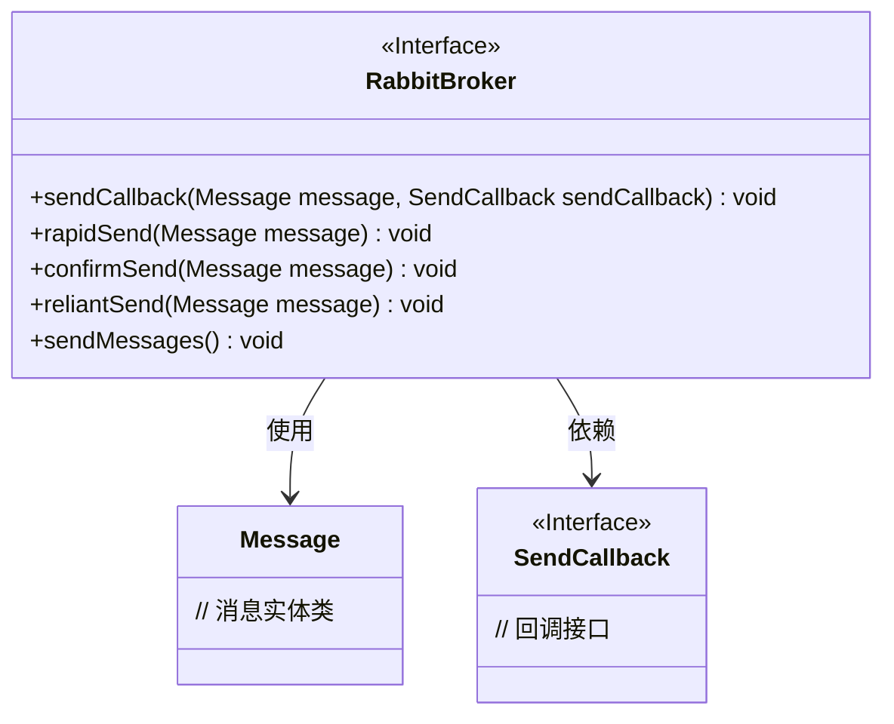
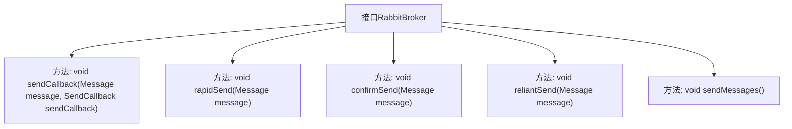

# 基础信息

|      |      |
|------|------|
| 名称 | RabbitBroker |
| 编码语言 | .java |
| 代码路径 | rabbit-parent/rabbit-core-producer/src/main/java/com/itihub/rabbit/producer/broker/RabbitBroker.java |
| 包名 | com.itihub.rabbit.producer.broker |
| 依赖项 | ['com.itihub.rabbit.api.Message', 'com.itihub.rabbit.api.SendCallback', 'java.util.concurrent.ExecutionException'] |
| 概述说明 | RabbitBroker接口提供五种消息发送方式：异步回调、无ACK快速、有ACK确认、可靠重试及批量发送。 |

# 说明

RabbitBroker接口定义了五种消息发送方法。sendCallback方法支持异步发送并带ACK确认和回调函数。rapidSend方法实现异步无ACK的快速发送。confirmSend方法提供异步带ACK的确认发送。reliantSend方法通过消息落库和重试机制确保可靠性。sendMessages方法利用ThreadLocal实现批量消息发送功能。所有方法均围绕不同场景下的消息传输需求设计。

# 类列表 Class Summary

| 名称   | 类型  | 说明 |
|-------|------|-------------|
| RabbitBroker | interface | RabbitBroker接口提供五种消息发送方式：异步回调、无ACK快速、有ACK确认、可靠重试和批量发送。 |

## 类 RabbitBroker

|      |      |
|------|------|
| 访问范围 | public |
| 类型 | interface |
| 名称 | RabbitBroker |
| 说明 | RabbitBroker接口提供五种消息发送方式：异步回调、无ACK快速、有ACK确认、可靠重试和批量发送。 |

### UML类图

这段类图展示了RabbitBroker消息代理接口的核心结构，该接口定义了五种不同特性的消息发送方式：带回调的异步发送(sendCallback)、无ACK的快速发送(rapidSend)、有ACK的确认发送(confirmSend)、具备持久化和重试机制的可靠发送(reliantSend)以及基于ThreadLocal的批量发送(sendMessages)。接口通过Message类承载消息内容，并使用SendCallback接口处理异步回调。每种发送方法针对不同业务场景设计，在消息可靠性、性能和功能复杂度之间提供梯度选择。

### 内部方法调用关系图

这段流程图展示了RabbitBroker接口的五个核心方法。sendCallback实现带回调的异步发送，rapidSend是无确认的快速发送，confirmSend是带确认的异步发送，reliantSend通过落库和重试保证可靠性，sendMessages则提供批量发送功能。每个方法箭头明确指向其定义，体现了消息发送的不同策略和保证级别。

### 字段列表 Field List

| 名称  | 类型  | 说明 |
|-------|-------|------|

### 方法列表 Method List

| 名称  | 类型  | 说明 |
|-------|-------|------|
| reliantSend | void | 发送消息方法，参数为Message对象。 |
| sendMessages | void | 发送消息的函数。 |
| rapidSend | void | 快速发送消息。 |
| confirmSend | void | 确认发送消息 |
| sendCallback | void | 发送消息回调方法，参数为消息和回调函数。 |

